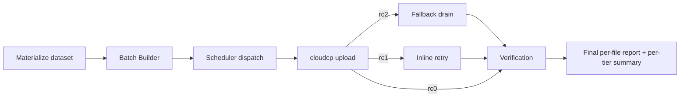

# Phase 6 — Complete Functional (End-to-End)

[← Back to master plan](../complete_plan.md)

> **What this phase is:** All stages run together through the broker — source on disk →
> batch builder → scheduler → cloudcp → fallback → verification → final report. This phase
> validates the **whole pipeline as one flow**, using realistic multi-tier datasets.

**Priority:** P0 (end-to-end correctness). Scale/wall-clock baselines are P2.
**Driven through:** the broker (full mode, not `--batch-only`), config
`/etc/bryck/bryckcloud/config.json`.

---

## 1. End-to-End Flow

---

## 2. Complete Coverage Summary — What Exists Today

This is the consolidated rollup of **every test case currently defined** across
[../../docs/testcaselist.xlsx](../../docs/testcaselist.xlsx) (72 cases) and the narrative
[../../docs/planv2.md](../../docs/planv2.md). The workbook is the source of truth; its phase
numbering is used verbatim here. (Mapping to this TestPlan's phase docs is in the last
column.)

### 2.1 Totals

| Workbook phase group | ID prefix | Cases | Maps to |
|---|---|---|---|
| Phase 1 — Batch Builder | `BB-*` | 21 | [01_batch_builder.md](01_batch_builder.md) |
| Phase 2 — Cloud Transfer (cloudcp) | `CC-*` | 10 | [03_cloudcp_binary.md](03_cloudcp_binary.md) |
| Phase 3 — Scheduler | `SCH-*` | 13 | [02_scheduler.md](02_scheduler.md) |
| Phase 4 — Fallback & Retry | `FB-*` | 12 | [05_fallback.md](05_fallback.md) |
| Phase 5 — Reporting & Verification | `RPT-*` | 8 | [04_reporting.md](04_reporting.md) |
| End-to-End Pipeline | `E2E-*` | 8 | this doc |
| **Total** | | **72** | |

### 2.2 Phase 1 — Batch Builder (`BB-*`, 21)

| Sub-area | IDs | Covers |
|---|---|---|
| 1.1 Functionality | BB-FN-01 … BB-FN-06 | Size-bucket assignment; count/byte seal; round-robin 8 slots; NUL byte-exact framing; atomic `*.tmp`→rename on SIGKILL; `source.index` completeness on ~6.87M corpus |
| 1.2 Resume | BB-RS-01 … BB-RS-04 | Mid-walk kill at 25/50/75%; skip walk when `scan_state=complete`; batch-ID uniqueness across restarts; no-xattr skip-set |
| 1.3 Configuration | BB-CFG-01 … BB-CFG-04 | Flat overrides nested; <10% free-space preflight; `CHECKPOINT_EVERY_FILES`; symlink skip / loop safety |
| 1.4 Edge Cases | BB-EDGE-01 … BB-EDGE-07 | Empty dir; single 0-byte; single 100 GB; unreadable subdir; non-writable batchmeta; 14-level tree; 255-byte filename |

### 2.3 Phase 2 — Cloud Transfer / cloudcp (`CC-*`, 10)

| Sub-area | IDs | Covers |
|---|---|---|
| 2.1 Upload Correctness | CC-UP-01 … CC-UP-07 | rc0 all-on-S3 + keys; rc2 `.lst` stays open; rc1 inline retry; key composition all 10 variants; intra-batch resume (SKIPPED); HeadObject-before-SUCCESS; multipart vs single PUT @64 MB |
| 2.2 Configuration | CC-CFG-01 … CC-CFG-03 | `BATCH_BUILDER_ONLY=true`; `LOCAL_AWS` MinIO endpoint; `CHUNK_SIZE_MB=8` |

### 2.4 Phase 3 — Scheduler (`SCH-*`, 13)

| Sub-area | IDs | Covers |
|---|---|---|
| 3.1 Weight & Work-steal | SCH-WT-01 … SCH-WT-05 | 6:4:3:3 steady state; six exhaustion/work-steal scenarios; 3-cycle convergence; hard `max_concurrent` caps; same-tier refill preference |
| 3.2 Network Profile | SCH-NP-01 | Profile switch changes scheduling only; batch files byte-identical |
| 3.3 Req/sec vs Bandwidth | SCH-RB-01 … SCH-RB-03 | Tiny = request-bound; large = bandwidth-bound; mixed uses both + faster than sequential |
| 3.4 Configuration | SCH-CFG-01 … SCH-CFG-04 | `NETWORK_PROFILE=dt2_100gbe`; `PARALLEL_WORKERS` = 1 / 32 / 0 |

### 2.5 Phase 4 — Fallback & Retry (`FB-*`, 12)

| Sub-area | IDs | Covers |
|---|---|---|
| 4.0 Fallback Functional | FB-FN-01 … FB-FN-07 | `.lst` ingest+drain; rc1 inline retry; HeadObject-before-FALLBACK_OK; transient vs permanent backoff; poison file doesn't block batch; crash-restart idempotency; verify waits for `_fallback_done` |
| 4.1 Configuration | FB-CFG-01 … FB-CFG-05 | `FALLBACK_ENABLED=False`; `TM_THREAD_POOL_SIZE` = 4 / 64; `rc1_retry.processes=4`; `rc1_retry.threads_per_process=8` |

### 2.6 Phase 5 — Reporting & Verification (`RPT-*`, 8)

| IDs | Covers |
|---|---|
| RPT-01 … RPT-08 | One status per file (OK/MISSING/FAILED/MISMATCH/EXTRA); refuse verify while scan in-progress; paused transfer doesn't verify; special-char merge-join; last-status-wins de-dup; monotonic progress counters; per-tier summary aggregation; failure-summary triage rows |

### 2.7 End-to-End Pipeline (`E2E-*`, 8)

| Sub-area | IDs | Covers |
|---|---|---|
| 6.1 Full Happy Path | E2E-HP-01 … E2E-HP-03 | DS1 4M tiny all-OK; DS5 120k large multipart; DS_MIXED ~6.87M with weighted scheduling |
| 6.2 Crash & Resume | E2E-RS-01 … E2E-RS-02 | Kill @25% → 100% no dup; fallback crash mid-drain resume |
| 6.3 Fault Injection | E2E-FI-01 … E2E-FI-03 | S3 unreachable 60 s → clean pause/resume; metadata disk fills → ENOSPC pause/recover; 3 concurrent isolated transfers |

> **Dataset naming note:** the workbook uses legacy labels (`DS1`, `DS5`, `DS_MIXED`, `DS3`,
> `DS4`). These map onto the catalog in
> [../../dataset_cloudcp/spec_files/dataset_map.json](../../dataset_cloudcp/spec_files/dataset_map.json):
> `DS1`≈tiny-heavy (cat 1 / DS-P1-02, cat 12), `DS4`≈small band, `DS5`≈large (DS-P1-06),
> `DS_MIXED`≈cat 6/7 (DS-P6-01 / DS-P7-*).

---

## 3. Complete Functional Test Cases (P0)

These are this phase's own end-to-end gates. They extend the workbook `E2E-*` cases onto the
catalog datasets.

| ID | Case | Dataset | Pass when |
|---|---|---|---|
| P6-01 | Clean full run, all tiers | DS-P7-01 (~91k files, CI baseline) | All files `OK`; source count == report count; per-tier summary complete; zero incomplete multipart |
| P6-02 | All file types covered | DS-P5-01 (26 types × tiers) | No type excluded/mis-routed/corrupted; all `OK` |
| P6-03 | All filename variants end-to-end | DS-P4-05 (20 variants cross-tier) | Every variant `OK`; byte-exact keys; no false MISSING/MISMATCH |
| P6-04 | Single-file transfers | DS-P9-01 … DS-P9-07 | Each routes to correct tier + upload path; `OK` |
| P6-05 | Resume across full pipeline | Kill broker mid-run, restart | No re-upload of done files; no lost files; final counts exact (see E2E-RS-01) |
| P6-06 | Fault-tolerant run | Inject 1% S3 errors | Failures retried via fallback/inline; final report all `OK` (or correctly `FAILED` for poison) |
| P6-07 | Config variation | Re-run DS-P7-01 under alt `NETWORK_PROFILE` | Same final report; scheduling differs; batch hashes identical (see SCH-NP-01) |

### 3.1 Performance / Scale (P2)

| ID | Case | Dataset | Measure |
|---|---|---|---|
| P6-P1 | Medium-scale regression | DS-P7-02 (~582k, ~3 TB) | Wall time; fallback exercised; per-tier summary |
| P6-P2 | Full-scale perf baseline | DS-P7-03 (~1.17M, ~10 TB) | Wall-clock baseline for regression comparison |
| P6-P3 | Tiny/small-heavy mix | DS-P12-01 / DS-P12-02 (1M / 2M) | Request-rate-bound throughput |

---

## 4. Coverage Improvements 

Gaps identified in the review of `planv2` + `testcaselist.xlsx`. All are **new** and marked
**To Be Added**. Priority follows the master model (correctness/robustness = P0, throughput =
P2). New IDs follow the workbook convention so they can be appended to
[../../docs/testcaselist.xlsx](../../docs/testcaselist.xlsx).

### 4.1 Limit / Boundary Testing (P0)

Existing cases hit *functional* seals; these push each stage to its **hard limits**.

| ID | Area | Case | Pass when |
|---|---|---|---|
| LIM-BB-01 | Batch limit | Max open batches per tier + very large single tier (millions of files) — sustained enumeration at the batch ceiling | No batch exceeds `max_files`/`target_size_mb`; open-batch count never exceeds `OPEN_BATCHES`; memory bounded; no crash |
| LIM-BB-02 | Batch limit | Extreme filename/path length + max directory depth at scale | Batches sealed correctly; no truncation; no stack/heap blow-up |
| LIM-SCH-01 | Scheduler limit | Max `PARALLEL_WORKERS` with all tiers saturated + long backlog | Slot sum == max_workers; caps honoured; no starvation; no scheduler deadlock |
| LIM-SCH-02 | Scheduler limit | Thousands of pending batches across tiers | Dispatch keeps up; no unbounded memory; fair convergence |
| LIM-CC-01 | Cloud transfer limit | Largest single object (≥100 GB) + max multipart part count | Multipart completes; zero incomplete parts; correct ETag/size |
| LIM-CC-02 | Cloud transfer limit | Batch at max file count + max batch bytes | All files uploaded; rc contract honoured; no timeout crash |
| LIM-FB-01 | Fallback limit | Very large `.lst` (hundreds of thousands of failures) at max `TM_THREAD_POOL_SIZE` | Full drain; every file terminal (FALLBACK_OK/failed); no OOM; bounded connections |
| LIM-FB-02 | Fallback limit | Sustained rc1 inline retries at max `rc1_retry.processes` × threads | All batches recover or fail cleanly; process pool bounded; no leak |

### 4.2 Config Profiles & Thread Scaling (P0) — **OPEN QUESTION**

Today most config params target **Bryckmini** only. We need per-hardware profiles and thread
scaling for **FXR**, **Bryck**, etc.

| ID | Case | Pass when |
|---|---|---|
| CFG-PROF-01 | Distinct `NETWORK_PROFILE`/thread profiles for Bryckmini vs FXR vs Bryck | Each profile loads its own `max_workers`, tier weights, pool/thread sizes, chunk size; scheduling matches the selected hardware |
| CFG-PROF-02 | Increase thread / worker counts per profile | Higher thread/worker settings take effect and scale throughput without instability |

> ❓ **Open question for the team (raised in review):** *How do we want to increase threads /
> add multiple hardware profiles (FXR, Bryck, …) beyond Bryckmini?* Options to decide: (a) new
> named `NETWORK_PROFILES` entries per hardware class; (b) auto-detect NIC/CPU and pick a
> profile; (c) explicit per-profile thread/worker overrides. **Decision needed before writing
> CFG-PROF-01/02 concretely.**

### 4.3 Config Edge Cases — Size-Filtered Transfers (P0)

Do we support / test config that transfers **only files of a specific size (or below/above a
threshold)**?

| ID | Case | Pass when |
|---|---|---|
| CFG-FILT-01 | Transfer only files ≤ threshold size | Only qualifying files enter batches + upload; larger files excluded and reported as skipped-by-filter (not MISSING) |
| CFG-FILT-02 | Transfer only files within a size window (min–max) | Only in-window files transferred; out-of-window excluded consistently in batch builder + report |

### 4.4 Basic UI Tests (P0)

Cross-reference — detailed in [08_ui_manual.md](08_ui_manual.md). Minimum here: create →
start → watch progress → pause/resume → final report render.

| ID | Case | Pass when |
|---|---|---|
| UI-BASIC-01 | Basic transfer lifecycle via UI | Create/start/progress/pause/resume/report all work; numbers reconcile with API + final report |

### 4.5 Post-Copy xattr Validation (P0)

After a copy completes, an **xattr change** is applied to source files. Validate the xattr
change is correct.

| ID | Case | Pass when |
|---|---|---|
| XATTR-01 | Post-copy xattr set correctly | After a successful transfer, each copied file carries the expected xattr key/value; unchanged files untouched; failed/MISSING files do **not** get the xattr |
| XATTR-02 | xattr not used for skip-set (regression) | Enumeration/skip still driven by report CSV (zero `getxattr`/`setxattr` on the hot scan path per BB-RS-04); the post-copy xattr is a *separate*, post-completion step |

### 4.6 Negative — OS Drive Full During Batch Creation (P0)

Simulate ~90% full: create **10% data in `/tmp`** (cleared on reboot) + **80% in another dir**,
then run. Observe how the batch builder behaves when the drive fills.

| ID | Case | Pass when |
|---|---|---|
| NEG-DISK-01 | Drive ~90% full at start | Preflight <10%-free check fires (see BB-CFG-02); clean refusal + non-zero exit; no partial `transfer_<id>/` |
| NEG-DISK-02 | Drive fills to full **during** batch-file creation | No crash; ENOSPC surfaced clearly; no half-written/`*.tmp` batch left visible; resumes after space freed (aligns with E2E-FI-02) |

### 4.7 Negative — CPU / Memory Saturation (P0)

Another process consumes ~90% CPU or memory; starting cloudcp / the transfer must not crash.

| ID | Case | Pass when |
|---|---|---|
| NEG-RES-01 | Start transfer under ~90% CPU load | Process starts (may be slower); no crash/segfault; completes or degrades gracefully |
| NEG-RES-02 | Start transfer under ~90% memory pressure | No OOM-kill of the broker without a clean error; no corruption; bounded allocation; graceful behaviour |

### 4.8 Negative — Network Saturation (P0)

Another service occupies ~90% of the link; cloudcp / the transfer must not crash.

| ID | Case | Pass when |
|---|---|---|
| NEG-NET-01 | Transfer under ~90% network saturation | No crash; upload proceeds at reduced throughput; retries/backoff behave; final report correct |

### 4.9 Service Restart / Kill During Transfer (P0)

While a cloud transfer runs, the **bryck service** is restarted or killed. Define and verify
the expected outcome (fail vs pause vs stop).

| ID | Case | Pass when |
|---|---|---|
| SVC-01 | `systemctl restart` bryck service mid-transfer | Transfer resumes cleanly on service restart (same transfer id); no dup uploads; no lost files (behaviour = **pause+resume**) |
| SVC-02 | Hard `kill -9` of the service/broker mid-transfer | On restart, resume from last checkpoint (≤ `CHECKPOINT_EVERY_FILES` behind); no corruption; batches recovered from on-disk state |
| SVC-03 | Documented state semantics | Expected behaviour (fail / pause / stop) is defined, observed, and consistent for both restart and kill |

---

## 5. Datasets Used

| Category | Datasets | Purpose |
|---|---|---|
| 7 — Mixed Full-Pipeline | DS-P7-01 (P0 gate), DS-P7-02 / DS-P7-03 (P2) | End-to-end + scale |
| 5 — File Type Coverage | DS-P5-01 | Type coverage |
| 4 — Encoding | DS-P4-05 | Variant round-trip |
| 9 — Single-File | DS-P9-01 … 07 | Boundary single files |
| 12 — Tiny/Small-Heavy | DS-P12-01 / 02 | P2 mixed scale |
| 1 — Single-Tier | DS-P1-02 (tiny), DS-P1-06 (large) | Limit + resource negatives |

Catalog: [../../dataset_cloudcp/spec_files/dataset_map.json](../../dataset_cloudcp/spec_files/dataset_map.json);
counts: [../../dataset_cloudcp/spec_files/manifest.json](../../dataset_cloudcp/spec_files/manifest.json).

---

## 6. Tools

- Broker full run (all stages).
- Every tool from prior phases (see [../tools_guide.md](../tools_guide.md)).
- **End-to-end runner** spanning materialize → verify → assert (**TBA**).
- **Resource-pressure harness** — `stress-ng` (CPU/mem), `fallocate`/`/tmp` fill (disk),
  `tc`/`iperf` (network saturation) for §4.6–4.8 (**TBA**).
- **xattr checker** — reads `getfattr`/`lsattr` after a run to validate §4.5 (**TBA**).

---

## 7. Open Questions

1. **Multi-hardware profiles / thread scaling (§4.2):** how to add FXR / Bryck profiles and
   increase threads/workers beyond Bryckmini (named profiles vs auto-detect vs overrides)?
2. **Size-filter semantics (§4.3):** should size-filtered-out files be reported as
   `SKIPPED-BY-FILTER` (distinct from `MISSING`)? Confirm the intended report status.
3. **Service restart/kill (§4.9):** confirm the *intended* contract — pause-and-resume vs
   fail — so SVC-01/02 assert the right outcome.

---

## 8. To Be Added

- Single end-to-end runner that chains all stages and asserts the final report against the
  manifest, rolling results into [../../docs/testcaselist.xlsx](../../docs/testcaselist.xlsx).
- Fault-injection integration for P6-06.
- Wall-clock capture + regression baseline store for P2 cases.
- **Limit/boundary suite** (§4.1) — LIM-* cases.
- **Multi-profile / thread-scaling config** (§4.2) — pending the open question.
- **Size-filter config cases** (§4.3) — CFG-FILT-*.
- **Post-copy xattr validation** (§4.5) — XATTR-* + xattr checker.
- **Resource-negative suite** (§4.6–4.8) — NEG-DISK-*, NEG-RES-*, NEG-NET-* + pressure harness.
- **Service restart/kill suite** (§4.9) — SVC-*.
- Append all new IDs above to [../../docs/testcaselist.xlsx](../../docs/testcaselist.xlsx).

Narrative reference: [../../docs/planv2.md](../../docs/planv2.md) (full pipeline);
existing register: [../../docs/testcaselist.xlsx](../../docs/testcaselist.xlsx).
