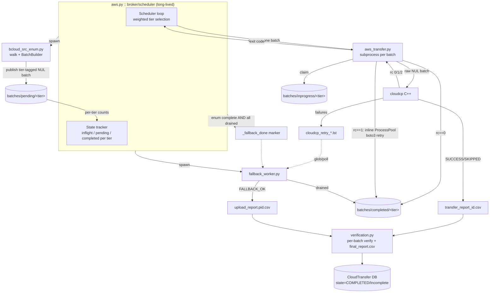
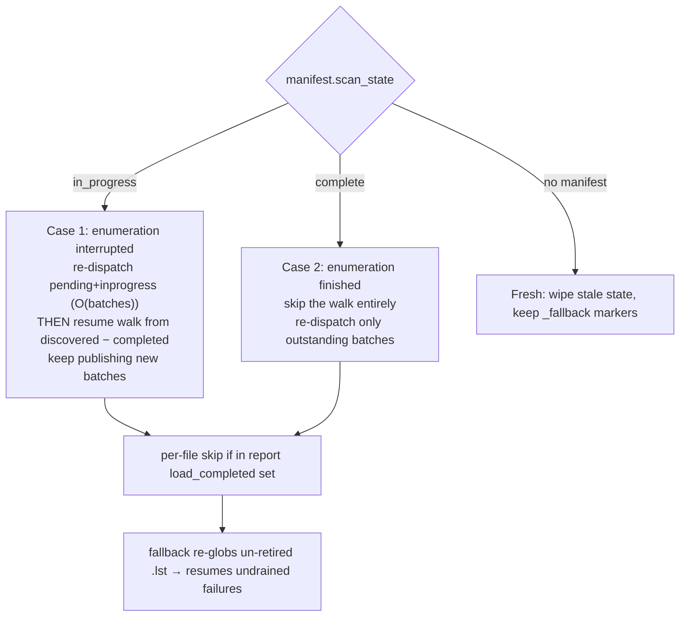
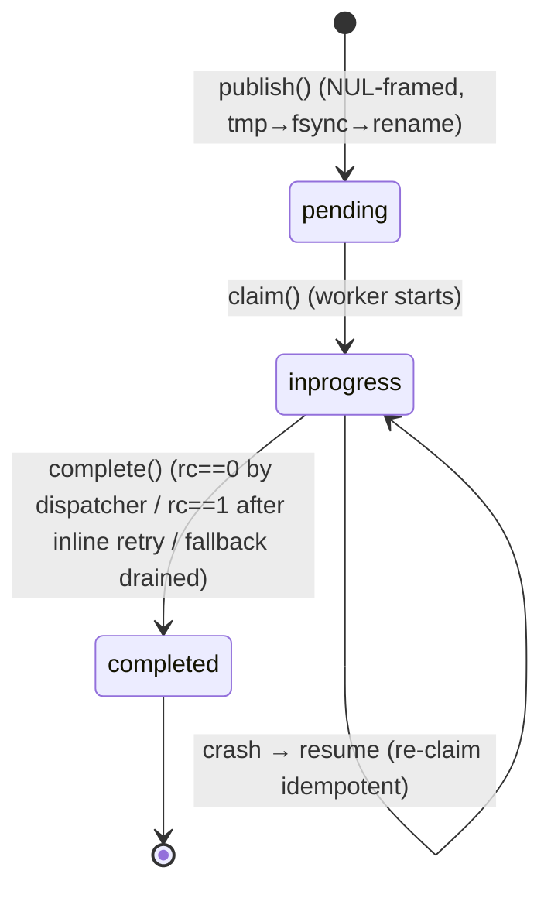
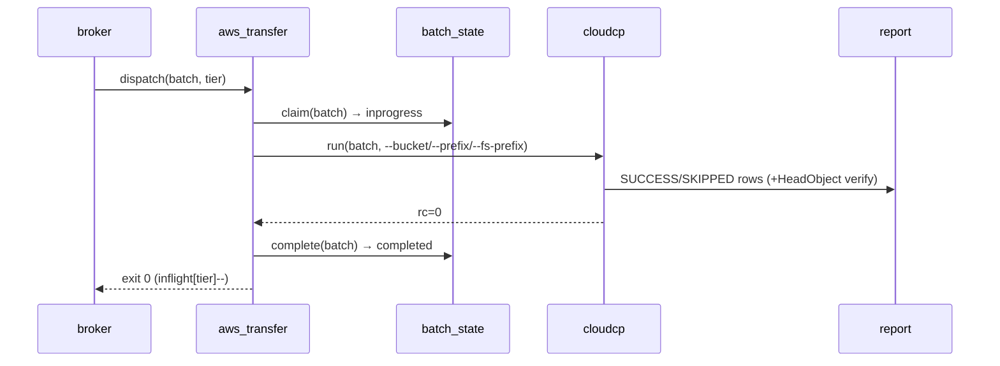
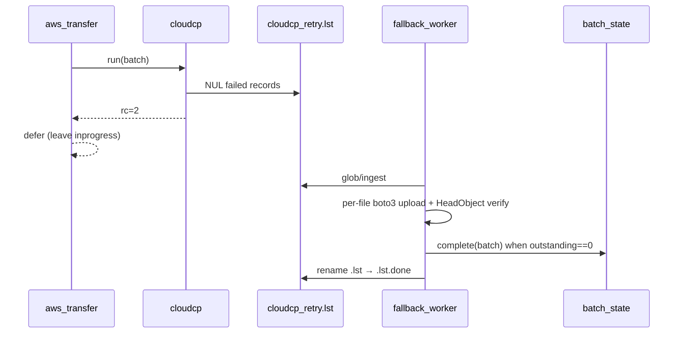
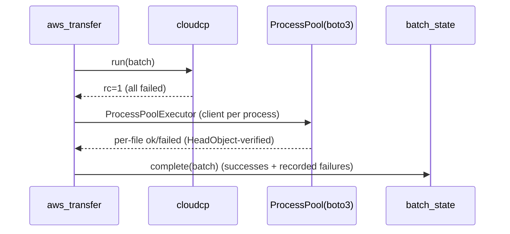
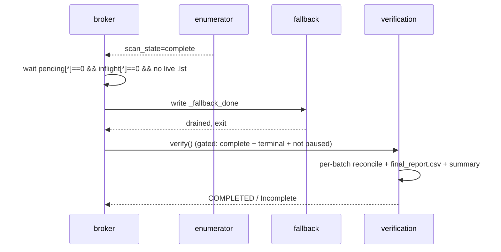

# Bcloud Cloud Transfer — Final Consolidated Design

**Status:** Authoritative design of record. Supersedes the individual design notes listed below
for anything they disagree on. Where a section says *(implemented)* the behaviour exists in code
today (uncommitted, cloudcp-v2 socket-free integration); *(planned)* marks the broker/scheduler
redesign work not yet built.

**This document consolidates and reconciles:**

| Source doc | Role folded in here |
|---|---|
| `docs/bcloud_redesign_proposal.md` | whole-service design, challenge list #1–#21, state machine, verification |
| `docs/batch_builder_design.md` | batch-sizing algorithm, tiers, throttles, bimodal-data rationale, resume |
| `docs/upload_pipeline_implementation.md` | current implemented pipeline, on-disk layout, protocols |
| `docs/broker_scheduler_redesign.md` | broker/scheduler, network profiles, weighted scheduling, rc==1 retry, batch-only, per-batch verify |
| `docs/pipelined_transfer_design.md` | streaming / backpressure motivation |
| `docs/config_reference.md` | config keys + on-disk layout |
| `docs/requirements.txt` | new authoritative requirements (broker, profiles, rc-handling, verify) |
| `docs/bcloud_redesign_tasklist.md` | task IDs B/C/D/O/FB/V/S/R (preserved in §29) |
| `cloudcp/docs/cloudcp_io_redesign.md` | **authoritative** cloudcp C++ contract (v2) |

A **reconciliation ledger** (§26) records every place the older docs and the current code diverged
and states which one this document adopts. Read that section if you are cross-referencing an old
doc.

---

## Table of contents

1. Purpose & scope
2. Design principles (P1–P11)
3. The data and the bottleneck — why the pipeline looks the way it does
4. System architecture
5. On-disk layout (authoritative)
6. Batch building — tiers, limits, open batches, NUL format
7. Enumeration and the two-case resume model
8. Network profiles
9. Broker / scheduler — weighted work-stealing dispatch
10. Batch state machine
11. cloudcp contract (v2, authoritative)
12. aws_transfer dispatch and exit-code semantics (0 / 1 / 2)
13. Fallback worker
14. Batch-completion protocol
15. Verification — per-batch reconciliation + final summary
16. Report schema and statuses
17. Transfer state machine
18. Throttles and backpressure
19. Special-character handling
20. Batch-builder-only mode
21. Configuration reference
22. Module-by-module responsibilities, I/O, exceptions
23. Cross-module protocols and agreements
24. Exception / error matrix
25. Sequence diagrams (rc 0 / 1 / 2, resume, completion→verify)
26. Reconciliation ledger — design docs vs. implementation
27. Implementation status (implemented vs. future)
28. Testing strategy
29. Task list (preserved)
30. Challenge → design traceability (#1–#21)
31. Open questions

---

## 1. Purpose & scope

Move a very large on-prem dataset (target scale ≈ **200 M files / ≈ 220 TB**, bimodal in size)
to/from AWS S3 (or an S3-compatible endpoint such as MinIO), **resumably**, **byte-exact for odd
filenames**, and **fast** — saturating either a 100 GbE datacentre link or a thin WAN, whichever is
in front of us. Credentials may be static access/secret keys **or** an assumed-role ARN
(`source_profile` + `role_arn`), read from the AWS config file.

The system replaces the previous `bcloud_src_enum | parallel aws_transfer.py` shell pipeline with a
long-lived **broker/scheduler** that owns dispatch, plus a C++ uploader (`cloudcp`) and a boto3
**fallback** for failures. It removes all `xattr`-based state, all `aws s3 cp` fallback, and all
per-file Python pre/post-processing of batch text.

**In scope:** upload path (primary), download path (symmetric, via an S3 lister — planned),
verification, resume, progress, error handling, configuration.

**Out of scope:** the C++ internals of cloudcp (contract only, §11), the queue-manager/daemon that
schedules whole *transfers* (unchanged), Azure/rclone paths (unchanged).

---

## 2. Design principles (P1–P11)

The first seven come from `batch_builder_design.md`; P8–P11 are the broker-era additions.

| # | Principle | Consequence |
|---|---|---|
| **P1** | **Bytes, never strings, on the hot path.** | Paths flow as raw filesystem bytes end-to-end (`os.fsencode`, surrogateescape). The only delimiter is `NUL`. No `.strip()`, no split on `\n`. |
| **P2** | **On-disk state is authoritative.** | A batch's directory is its state; append-only journals/CSVs are the durable truth. Memory is a cache rebuilt from disk on restart. |
| **P3** | **No xattr.** | Resume derives from the report + batch-state dirs, never from `getxattr`/`setxattr`. (xattr code is retained but dormant — a safety net, never on the hot path.) |
| **P4** | **Right-size work per bucket.** | Files are classified into size tiers; each tier has its own batch limits tuned to its bottleneck (requests/s vs GB/s). |
| **P5** | **Atomic publish.** | Every durable artifact is written `tmp → fsync → rename`. A batch is either absent or complete — never half-written. |
| **P6** | **Fail fast on space.** | Preflight requires ≥ `MIN_FREE_PCT` free; a write that hits `ENOSPC` pauses cleanly, never crashes. |
| **P7** | **Scan completeness is a barrier.** | Verification may only treat "in source but not uploaded" as *missing* once `scan_state=complete` **and** all batches are terminal **and** pause is not requested. |
| **P8** | **The broker owns dispatch, not the shell.** | A long-lived Python scheduler tracks inflight/pending/completed per tier and decides what runs next. GNU `parallel` is removed. |
| **P9** | **Weights guide, never block.** | Weighted fairness applies only among tiers that currently have work; an empty tier never starves the others (work-stealing). |
| **P10** | **cloudcp owns its own I/O.** | cloudcp reads the raw NUL batch and writes its own report/failed-log/retry-list. Python does no pre/post text processing. Failure handoff is file-driven (a durable `.lst`), not a socket. |
| **P11** | **Every batch is verified.** | Completion of a batch means *cloudcp ran and its failures were drained*; a per-batch check (batch file vs. report) runs before the final summary. |

---

## 3. The data and the bottleneck — why the pipeline looks the way it does

*(This section mirrors `batch_builder_design.md §5A`, written from scratch, because every knob in the
system exists to serve the shape of the data.)*

The corpus is **bimodal**:

| Class | Count | Bytes | Bound by |
|---|---|---|---|
| **Small** files (< ~1 MB) | ≈ 165 M (**82 % of files**) | ≈ 18 % of bytes | **requests/sec** (S3 PUT rate, TLS handshakes, round-trips) |
| **Large** files (≥ ~1 MB) | ≈ 40 M (**18 % of files**) | ≈ 82 % of bytes | **bandwidth** (GB/sec, multipart throughput) |

These two classes bottleneck on **different physical resources**. If you upload them sequentially —
"all large, then all small" — one resource runs flat out while the other sits idle, and the whole
transfer takes as long as the sum of both races. The core insight of the design is therefore:

> **Run both races concurrently, each tuned to its own bottleneck.**

Every mechanism below is in service of that:

- **Size tiers (buckets)** so each class is packaged differently (§6).
- **Dual per-tier limits** (`target_bytes` OR `max_files`, whichever trips first) so small-file
  batches stay request-count-shaped and large-file batches stay byte-shaped.
- **Multiple open batches per tier** (round-robin) so batches of *every* class become available
  early — you never wait for the whole small-file backlog to package before any large batch ships.
- **Weighted scheduling** so a chosen share of workers pushes bytes (saturate the pipe) while a
  guaranteed share grinds the request backlog — simultaneously, not one after the other (§8, §9).
- **Network profiles** so the same batches on disk can be scheduled large-heavy on a fat pipe or
  small-heavy on a thin one, by changing only worker-slot *weights*, never the packaging (§8).

Packaging is fixed; scheduling is profile-driven. That separation is what makes the system tunable
for a new link: you add a profile, you do not repackage 220 TB.

---

## 4. System architecture

### 4.1 Components and ownership boundaries

| Component | File(s) | Owns |
|---|---|---|
| **Broker / scheduler** | `aws.py` (or a dedicated `batch_scheduler.py` — §31 Q5) | Long-lived controller. Spawns enumerator + fallback; loads the network profile; runs the weighted dispatch loop; tracks inflight/pending/completed per tier; triggers verification. Replaces GNU `parallel`. |
| **Enumerator** | `bcloud_src_enum.py` | Resumable walk of the source; feeds `BatchBuilder`; publishes tier-tagged batches; frontier journaling; free-space guards; batch-only mode. |
| **BatchBuilder** | `BatchBuilder.py` | Classifies files into tiers; packs them into right-sized NUL batches; round-robins open batches; seals/flushes atomically. |
| **Batch state** | `batch_state.py` | The batch-file state machine (`pending → inprogress → completed`), tier-aware, atomic renames, idempotent claim/complete, per-tier counts. |
| **Dispatcher** | `aws_transfer.py` | One invocation per batch: claims it, runs cloudcp, applies the exit-code rule, and (rc==1) runs the inline whole-batch boto3 retry. |
| **cloudcp** | external C++ (`cloudcp/`) | Per-file upload/download + HeadObject verify; writes its own report, failed-log, and per-batch retry `.lst`. |
| **Fallback** | `fallback_worker.py` | Persistent boto3 pool that drains cloudcp's `.lst` failures per-file, verifies, and completes those batches. |
| **Report** | `upload_report.py` | Report schema, merge of cloudcp CSV + fallback shards, resume-skip set, final report, per-batch verify helpers. |
| **Verification** | `verification.py` | Per-batch reconciliation (batch file vs. report) + merged final summary; state gate. |
| **Completion** | `cloud_transfer.py` | Wraps the run, reconciles final state, invokes verification, writes DB state. |

**Boundary rules:** BatchBuilder writes only `pending/`. The broker claims from `pending/`, tracks
inflight, and transitions batches. cloudcp owns per-file transfer + its own outputs. Fallback owns
`.lst` retries + completing those batches. Verification consumes only durable flat files. No module
reaches into another's directory.

### 4.2 End-to-end flow (target / planned broker model)



The **currently implemented** flow is identical except that dispatch is still GNU `parallel`
(one `aws_transfer.py` per batch, FIFO) and batches are not yet tier-partitioned on disk. The
broker/scheduler (§9), tier partitioning (§5, §10), network profiles (§8), rc==1 inline retry (§12),
batch-only mode (§20) and per-batch verify (§15) are the planned redesign layered on top.

---

## 5. On-disk layout (authoritative)

Two roots per transfer: **batch metadata** under `BATCH_FILE_DIR` and **logs/reports** under
`LOGS_DIR`.

```
<BATCH_FILE_DIR>/transfer_<id>/
├── manifest.json                       # scan_state, seq_high_water, totals, active_profile
├── scan.discovered / scan.completed    # NUL frontier journals (directory walk resume)
├── _fallback_done                      # marker: broker signals fallback may finish draining
└── batches/
    ├── pending/<tier>/batch_NNNNNN.txt      # NUL-framed, ready to dispatch
    ├── inprogress/<tier>/batch_NNNNNN.txt   # claimed by a dispatcher / crashed-and-resumable
    └── completed/<tier>/batch_NNNNNN.txt    # terminal (cloudcp ok, or fallback drained, or rc==1 retried)

<LOGS_DIR>/cloud_transfer_<id>/
├── transfer_report_<id>.csv                 # cloudcp SUCCESS/SKIPPED rows (shared, flock+O_APPEND)
├── cloudcp_failed.log                       # cloudcp human failure log
├── cloudcp_retry_<id>_batch_NNNNNN.lst[.done]  # per-batch retry queue → fallback; retired to .done
├── cloud_transfer_txhistory_<id>.log        # per-file history (proof the run initialised)
├── cloud_transfer_<id>.log                  # failure log (non-empty ⇒ transfer PAUSED)
├── final_report.csv                         # merged at finalize (AbsoluteFilePath,S3Path,FileSize,ETag)
└── report/
    ├── upload_report.<pid>.csv              # FALLBACK_OK / MP_OK rows (fallback + rc==1 retry)
    ├── error.<pid>.log                      # human errors (fallback + rc==1 retry)
    └── failed_uploads.<pid>                 # NUL terminal failures (the global failed log)
```

**Tier partitioning (planned):** `<tier>` ∈ `{zero, tiny, small, medium, large}`. It replaces the
current flat `batches/{pending,inprogress,completed}/batch_NNNNNN.txt`. The tier lives in the
**path**, giving the scheduler O(1) per-tier counts by directory listing. Batch ids remain globally
unique (`seq_high_water` in manifest), so names never collide across tiers or resume. A legacy flat
layout (no tier subdir) is still readable — treated as tier `unknown` (scheduled at `medium`
weight) — so an in-flight transfer created before the upgrade can resume.

> **Reconciliation note.** The proposal (`bcloud_redesign_proposal.md §14.3`) specified a
> richer five-directory state machine — `pending / inflight / fallback_wait / processed / failed`
> with names `<bucket>_<seq>.batch`. This design **collapses that to three directories** (`pending
> / inprogress / completed`) because the socket-free, file-driven model expresses the other states
> as *files* rather than *directories*: `fallback_wait` = a live `cloudcp_retry_*.lst`, `failed` =
> rows in `failed_uploads.<pid>`, `processed` = `completed/`. This is simpler, already implemented,
> and equally crash-safe. See §26.

---

## 6. Batch building — tiers, limits, open batches, NUL format

### 6.1 Size tiers and per-tier limits *(implemented defaults; profile-overridable)*

Each tier carries three knobs: `max_files`, `target_size_mb`, `open_batches`.

| Tier | Size range | max_files | target MB | open_batches | Bottleneck it serves |
|---|---|---|---|---|---|
| `zero` | `< 1 B` | 2000 | 0 | 4 | pathological / empty files |
| `tiny` | `< 1 MB` | 511 | 256 | 8 | requests/sec |
| `small` | `< 64 MB` | 317 | 2048 | 8 | mixed |
| `medium` | `< 1 GB` | 50 | 10240 | 8 | bandwidth |
| `large` | `≥ 1 GB` | 5 | 51200 | 8 | bandwidth |

A batch seals when adding the next file would exceed **either** `target_size` **or** `max_files` —
whichever trips first. That dual limit is what keeps a tiny-file batch a *request-count* unit and a
large-file batch a *byte* unit.

### 6.2 Algorithm (hot path)

```
assign_file(FileEntry(size, path)):
    bucket = classify_bucket(size)                 # O(tiers); last tier = large = ∞
    slot   = choose_batch(bucket)                  # round-robin over open_batches[bucket]
    if slot.nfiles > 0 and (slot.nbytes + size > bucket.target
                            or slot.nfiles + 1 > bucket.max_files):
        seal(slot)                                 # append to ready_batches; new id
        slot = fresh open batch in that bucket
    slot.add(path_bytes, size)

get_ready_batches()  -> drains sealed batches to the enumerator (streaming)
flush()              -> seal all open batches (terminal, end of scan)
flush_open()         -> seal + replace open batches (mid-scan checkpoint; published batch is immutable)
```

- **Multiple open batches per tier** (`open_batches`, default 8) keep several batches of every class
  filling at once → the scheduler always has work of every tier available early (no "all tiny finish
  last" starvation). Memory is **O(open batches × tiers)** (≈ 8×5 tuples-of-lists), *not* O(total
  files) — it does not grow with the 200 M corpus.
- **Round-robin** across a tier's open batches staggers their close times → a smooth publish rate
  that keeps worker slots continuously fed.
- **Config resolution priority:** flat key (e.g. `TINYFILE_BATCH_SIZE`) > nested
  `BATCH.TINY.BATCH_SIZE` > default. `start_seq` (manifest `seq_high_water`) guarantees ids never
  collide across resume.

### 6.3 NUL batch format (contract with cloudcp)

Each record is the file's **absolute path as raw filesystem bytes**, terminated by a single `NUL`:

```
<abspath-bytes>\0<abspath-bytes>\0 ...
```

Written binary via `os.fsencode(path) + b"\0"`, `tmp → fsync → rename`. `NUL` is the only byte
illegal in a POSIX path, so filenames containing newline, CR, TAB, trailing spaces, or non-UTF-8
Latin-1 bytes survive **byte-for-byte** (challenges #9–#12; worked examples in §19).

> **Absolute paths + prefixes, by user decision.** BatchBuilder emits **absolute** paths and lets
> cloudcp derive the key from `--fs-prefix` (stripped) + `--prefix` (joined). This gives a full
> file-list-and-size report and keeps key composition in one place (cloudcp). Earlier drafts stored
> relative paths; that is superseded.

**Optional size-bearing record (`BATCH_INCLUDE_SIZE`).** The enumerator already `stat`s every file
(for tiering), so the size can be persisted in the batch and **reused everywhere** instead of a
redundant `stat` in cloudcp and in progress accounting. When `BATCH_INCLUDE_SIZE` is set, each record
becomes `<size>\0<path>\0` (size = bare ASCII digits):

```
<size>\0<abspath-bytes>\0<size>\0<abspath-bytes>\0 ...
```

Readers **auto-detect** the layout: a batch whose first NUL field is all-digits is size-bearing,
otherwise it is path-only (a real batch path is always `/…` or `s3://…`, never a bare integer). The
flag is **off by default** (path-only, the current cloudcp contract) and both the Python enumerator
and cloudcp read the same key; flip it on only once cloudcp is built to parse the size prefix. The
Python readers handle both layouts regardless, so a mixed/legacy set of batches on resume is safe.
`batch_state.publish(entries, include_size=…)` is the single writer;
`batch_state.read_batch_records()` the single reader (`read_batch_file()` drops the size).

---

## 7. Enumeration and the two-case resume model

The enumerator (`bcloud_src_enum.py`) does a resumable BFS walk (a `deque` frontier), streaming
batches to disk as they seal — it never holds a full listing in memory.

```
dir = frontier.popleft()
with os.scandir(os.fsdecode(dir)) as it:            # errors -> scan_errors.log, dir skipped, continue
    for e in it:
        b = os.fsencode(e.path)                      # EXACT on-disk bytes
        if e.is_symlink() and not follow_symlinks: continue
        if e.is_dir(...):  frontier.append(b); discovered.append(b)
        elif e.is_file(...):
            st = e.stat(...)
            if already_transferred(b):  continue     # per-file skip via report (no xattr, no re-upload)
            builder.assign_file(FileEntry(st.st_size, b))
    publish sealed batches immediately              # streaming; parallel dispatch can start early
completed.append(dir)
if files_since_ckpt >= CHECKPOINT_EVERY_FILES: checkpoint()
```

### 7.1 Frontier journaling (scan-level resume)

Two append-only, fsync'd logs form the crash boundary:

```
scan.discovered   # every dir ever enqueued
scan.completed    # every dir fully listed
frontier(resume) = discovered − completed
```

**Crash-consistency invariant** — per directory the enumerator strictly orders: (1) the dir's
sealed batches are already atomically renamed (durable); (2) append children → `scan.discovered`,
fsync; (3) append the dir → `scan.completed`, fsync; (4) only then treat children as eligible. So a
child is never "started-and-lost": after a crash every unfinished dir is still in
`discovered − completed`. Resume reloads the frontier, re-enqueues it, restores `seq_high_water`
(bumped in bulk, never reused). Depth-independent (frontier on disk, not the call stack).

### 7.2 The two resume cases (both required by requirements.txt)



- **Case 1 (enumeration interrupted):** the broker re-dispatches already-published batches
  (O(batches), no re-walk) *and* the enumerator resumes the walk from the frontier, publishing new
  batches. Both progress concurrently.
- **Case 2 (enumeration finished):** the walk is skipped; only outstanding batches
  (`pending + inprogress`) are re-dispatched.
- **Crash safety across both:** `.lst` files are durable → the fallback re-globs on restart; batch
  transitions are atomic renames; `claim` dedups already-completed batches; a partially-done batch
  re-runs only its unfinished files (report skip-set + cloudcp `SKIPPED`).

### 7.3 CSV-mode resume (reference/test path)

The standalone `batch_builder.py` CSV prototype has no directory frontier, so it resumes on an
**input-position checkpoint**: flush all open batches, fsync `batches.created` + `source.index`,
record `index_len`, atomically write `manifest.json{scan_state=in_progress, records_done,
seq_high_water, index_len}`. Resume truncates `source.index` back to `index_len`, drops `.tmp`, and
skips the first `records_done` rows. Verified: kill a 500 000-row run mid-stream, resume → exactly
500 000 unique records, zero loss / zero duplication.

---

## 8. Network profiles

*(planned — locked with the user)*

A `NETWORK_PROFILES` config block defines named profiles; the top-level key **`NETWORK_PROFILE`**
selects one (default `default_balanced`). A profile tunes batch sizing, scheduling weights, per-tier
concurrency caps, retry-pool sizing, and chunk sizes. **Static now**; NIC-speed auto-detect is
future work. The selected profile is recorded in `manifest.json:active_profile`.

| Knob | Meaning |
|---|---|
| `max_workers` | Global cap on concurrent `aws_transfer`/cloudcp processes. |
| `tier.<T>.weight` | Relative worker-slot share when all tiers have work (higher = more slots). |
| `tier.<T>.max_concurrent` | Hard cap on inflight batches of tier T. |
| `tier.<T>.batch_size` / `target_size_mb` / `open_batches` | Passed through to BatchBuilder (existing per-tier keys). |
| `rc1_retry.processes` / `threads_per_process` | Inline whole-batch ProcessPool sizing (§12). |
| `fallback.*` | Existing `FALLBACK` knobs (per-file boto3 retry). |
| `multipart_chunksize_mb` | cloudcp / boto3 multipart chunk size. |

**Starter profiles (indicative — tune during implementation, §31 Q3):**

| Profile | max_workers | large / medium / small / tiny weight | Rationale |
|---|---|---|---|
| `dt2_100gbe` | 32 | 6 / 4 / 3 / 3 | Bandwidth is abundant → most slots push the 180 TB of large files to saturate 100 GbE; a guaranteed minority keeps draining the 165 M small-file request backlog alongside. |
| `low_bandwidth` (a.k.a. `wan_lowbw`) | 4 | 3 / 3 / 4 / 6 | The thin pipe is the bottleneck for large files → prioritise the request-cheap small-file backlog; trickle large files through the limited bandwidth. |
| `default_balanced` | 16 | 3 / 3 / 2 / 1 | Current defaults. |

**Read weights as shares:** of every `max_workers` slots, `weight[T] / Σweight` pull tier-T batches.
Both classes drain *simultaneously* — using different physical resources — instead of one racing
while the other idles. An earlier "strict order (all large, then all tiny)" idea was **rejected**
because it recreates exactly the starvation we are avoiding (§3).

> **Reconciliation note.** `batch_builder_design.md` called this block `schedule_profiles` with
> profiles `dt2_100gbe` / `wan_lowbw` and an `order` + `weights` pair nested under `BATCH_BUILDER`.
> This design adopts the broker-redesign naming — top-level `NETWORK_PROFILE` selecting from
> `NETWORK_PROFILES`, `wan_lowbw` renamed `low_bandwidth`, plus `default_balanced`. `order` is kept
> only as a tie-break / spare-slot preference; the weighted algorithm (§9) makes it largely
> unnecessary. See §26.

---

## 9. Broker / scheduler — weighted work-stealing dispatch

*(planned)*

`aws.py` becomes a long-lived broker. It:

1. Loads the selected `NETWORK_PROFILE` → weights, caps, `max_workers`, pool + chunk sizes.
2. Spawns the **enumerator** (streams tier-tagged batches to `batches/pending/<tier>/`) and the
   **fallback worker** (socket-free, unchanged).
3. Runs the **scheduler loop**: while there is work and a free worker slot, pick the next batch by
   the weighted algorithm below, spawn an `aws_transfer.py` subprocess for that one batch, and track
   it inflight.
4. On each `aws_transfer` exit, decrement `inflight[tier]` and schedule the next batch.
5. When enumeration is complete **and** `pending[*]==0` **and** `inflight[*]==0` **and** the fallback
   has no un-retired `.lst`, drop `_fallback_done`, wait for the fallback, then run verification.

### 9.1 The selection algorithm (deficit weighted round-robin + candidate filtering)

**State:** `pending[T]` (from `listdir(batches/pending/<T>)`), `inflight[T]` (broker counter),
`weight[T]`, `max_concurrent[T]`, `max_workers`.

```
free = max_workers - Σ inflight
while free > 0 and any(pending[T] > 0):
    candidates = { T : pending[T] > 0 and inflight[T] < max_concurrent[T] }
    if not candidates: break                         # all eligible tiers at their cap
    T* = argmax_{T in candidates} ( weight[T] / (inflight[T] + 1) )   # largest weighted deficit
    dispatch_one(T*)                                 # spawn aws_transfer for a T* batch
    inflight[T*] += 1 ; pending[T*] -= 1 ; free -= 1
```

This one rule gives three required behaviours for free:

- **Work-stealing (P9):** `candidates` only contains tiers with pending work, so if large/medium are
  empty, small/tiny fill every free slot. Weights never block a non-empty tier from consuming idle
  workers — exactly "if all batches available use weights, else consume all workers with what's
  available."
- **Weight fairness:** among tiers that currently have work, `weight[T]/(inflight[T]+1)` distributes
  slots in proportion to weight.
- **"Prefer the same bucket after completion":** when a large batch finishes and more large are
  pending, `weight[large]/(inflight[large]+1)` jumps back up, so the freed slot is likely refilled
  with large — bounded by `max_concurrent[large]`.

### 9.2 Dispatch protocol (broker ↔ aws_transfer)

The broker spawns one subprocess per batch:

```
aws_transfer.py <id> <upload|download> <batch_path> <dst s3://…> <base_src> [--expected-size …] [endpoint…]
```

`aws_transfer` claims the batch, runs cloudcp, applies the exit-code rule, and (rc==1) runs the
inline retry. The broker learns the outcome from the **subprocess exit code** and/or the
batch-state transition, then decrements `inflight[tier]` and loops. On a subprocess *crash* the
batch stays `inprogress` and is re-dispatched (the broker may cap crash-retries per batch).

### 9.3 Broker recovery

The broker is **stateless-recoverable**: on restart it rebuilds `inflight`/`pending` from disk
(`inprogress`/`pending` per tier) and resumes scheduling. Any batch left `inprogress` by a crashed
worker is re-dispatched (idempotent via the tx-skip set).

---

## 10. Batch state machine

A batch file's **directory is its state**; every transition is an atomic `os.rename`.



`batch_state.py` API *(tier arg is the planned addition)*:

| API | In | Out | Notes |
|---|---|---|---|
| `publish(dir, name, lines, tier=…)` | name + path iterable | writes `pending/<tier>/<name>` | NUL-framed binary, atomic. |
| `claim(dir, name, tier=…)` | name | path or `None` | `None` if already `completed` (resume dedup); idempotent re-claim of `inprogress`; resolves lost races. |
| `complete(dir, name, tier=…)` | name | — | atomic `inprogress→completed`; idempotent + cross-process safe. |
| `to_run(dir)` | — | `[(tier, name, path)]` | `pending + inprogress` for resume re-dispatch (iterates all tier subdirs). |
| `counts(dir)` | — | per-tier `{pending, inprogress, completed}` | scheduler + progress. |
| `reset_inprogress_tmp(dir)` | — | — | clears stale `.tmp` from an interrupted publish. |

Batch ids stay globally unique across tiers and resume (`seq_high_water`). *Rejected alternative:*
encoding the tier in the filename (`batch_<tier>_NNNNNN.txt`) — tier subdirs give O(1) per-tier
counts and keep names stable.

---

## 11. cloudcp contract (v2, authoritative)

This is the **shipped** cloudcp-v2 contract from `cloudcp/docs/cloudcp_io_redesign.md`. It
**supersedes** the older `--source-root/--bucket-prefix/--txlog/txhistory` contract sketched in the
proposal (§26).

### 11.1 Invocation

```
cloudcp <batch_file> \
        --bucket   <bucket> \
        --prefix   <bucket-key-prefix> \
        --fs-prefix <local-root> \
        --transfer-id <id> \
        [--endpoint-url <url>]
```

| Arg | Meaning |
|---|---|
| `<batch_file>` | positional; **NUL-framed raw bytes** batch (§6.3). Never line-split. |
| `--bucket` | destination bucket (upload) / source bucket (download). |
| `--prefix` | S3 key prefix (upload target / download source). |
| `--fs-prefix` | local root: on upload, stripped from each absolute path to make the relpath; on download, the directory data is written under. |
| `--transfer-id` | names the per-transfer report CSV and appears in the retry `.lst` name. |
| `--endpoint-url` | optional custom S3/MinIO endpoint. |

`log_dir` is **not** a CLI arg — cloudcp reads it from `config.json`. All outputs go under
`<LOGS_DIR>/cloud_transfer_<id>/`.

### 11.2 Batch input & direction

Records are raw bytes separated by `\0`, used verbatim. Direction is detected **per record**: a
record starting with `s3://` is a **download**; otherwise it is an absolute path = **upload**. No
trimming/stripping of path bytes.

**Size-bearing batches (`BATCH_INCLUDE_SIZE`, §6.3).** cloudcp must read the same config flag. When
set, batch records are `<size>\0<path>\0` pairs (size = bare ASCII digits) and cloudcp **reuses that
size** (for multipart routing and the size it records) instead of `stat`-ing the file; when unset
(default), records are path-only as today. cloudcp auto-detects identically to the Python readers: a
batch whose first NUL field is all-digits is size-bearing. This is the **small cloudcp change** the
size-in-batch optimisation requires; until it ships, keep `BATCH_INCLUDE_SIZE` off.

### 11.3 Key composition & normalization

`/`-join: trim one trailing `/` from the left side, trim leading `/` from the right, join with one
`/`; an empty prefix uses the right side as-is.

```
upload:  abs=/bryck/dir1/dir2/file.txt  --fs-prefix=/bryck/dir1
         relpath = dir2/file.txt        key = <prefix>/dir2/file.txt
         s3path  = s3://<bucket>/<prefix>/dir2/file.txt
```

**No character-encoding conversion.** The key is the **raw relpath bytes** appended to the prefix;
the SDK percent-encodes on the wire and S3 stores the decoded raw bytes. Trailing spaces, `\r`,
embedded `\n`, and non-UTF-8 bytes are preserved.

> **Reconciliation note.** The proposal specified a UTF-8 → Latin-1 → percent-encode normalization
> ladder. cloudcp-v2 **does not** do that — it passes raw bytes and lets the SDK handle wire
> encoding. This document adopts the raw-bytes contract (§26).

### 11.4 Outputs (all under `log_dir`)

| File | Scope | Concurrency | Format |
|---|---|---|---|
| `transfer_report_<id>.csv` | per-transfer, shared | `flock` + `O_APPEND` | `local_path,s3path,size,etag,status,attempt,finished_at` (CSV-quoted, NUL-safe). size/etag from confirming HeadObject; status ∈ `SUCCESS`, `SKIPPED`. |
| `cloudcp_failed.log` | shared | `flock` + `O_APPEND` | `ts, pid, path(raw), attempts, reason` (human). |
| `cloudcp_retry_<id>_<batch>.lst` | **per-batch** | temp + atomic `rename` (no lock) | **NUL-framed** `local_path \0 s3path \0 size \0 last_error \0` — the boto3 fallback queue. |

`FALLBACK_OK` is **never** written by cloudcp; it is written by the boto3 fallback only.

### 11.5 Exit codes

| rc | Meaning | `.lst`? |
|---|---|---|
| `0` | batch completed, every object `SUCCESS`/`SKIPPED`, no failures. | no |
| `2` | batch completed, at least one object failed. | **yes** (failed objects queued) |
| `1` | fatal — could not run to completion (bad/missing args, unreadable batch, uncreatable outputs) **or** the batch completed but **every** object failed. | possibly |

### 11.6 HeadObject verify, skip, and no-resume

- **End-of-batch HeadObject pass** on provisionally-OK entries only (not on FAILED, to avoid 404
  backoff stalls). Upload: existence + `ContentLength`. Download: local file exists + size matches.
  Pass → `SUCCESS` with size+etag; fail → moved to failed outputs. Controlled by
  `TXR_BATCH_VERIFYSIZE`/`BATCH_VERIFY_SIZE` (off = record `SUCCESS` without the round-trip).
- **Skip:** before transfer, HeadObject the destination; if it exists with matching size →
  `SKIPPED` (recorded, not retransferred).
- **No resume inside cloudcp:** there is no `--resume`, no CSV dedup scan. cloudcp always processes
  the entire batch it is given. If killed before completion it writes **nothing** (no half-written
  CSV/`.lst`). Intra-batch resume across *runs* is achieved on the Python side by the report
  skip-set (§7) — cloudcp itself is stateless per invocation.

### 11.7 Multipart / routing

New `CLOUDCP` config: `MULTIPART_THRESHOLD_MB` (default 64; `< threshold` → CRT, `≥ threshold` →
TransferManager) and `MULTIPART_CHUNKSIZE_MB` (default 64; falls back to `CHUNK_SIZE_MB`). Uploads
route on local file size; downloads currently CRT unconditionally, sequential.

---

## 12. aws_transfer dispatch and exit-code semantics (0 / 1 / 2)

One process per batch. It claims the batch, runs cloudcp (§11.1), and applies the **authoritative
exit-code rule** below — which reconciles requirements.txt with the current implementation:

| rc | Meaning | Handler | Who completes the batch |
|---|---|---|---|
| **0** | all files uploaded | `aws_transfer` completes the batch inline. | dispatcher |
| **2** | partial — some failed (`.lst` written) | `.lst` → fallback (per-file boto3). | **fallback**, after it drains the `.lst` |
| **1** | whole batch failed | `aws_transfer` runs an **inline ProcessPool boto3 retry of the whole batch** (§12.1), then completes. | dispatcher (after retry) |

> **Reconciliation note.** The current implementation treats rc==1-with-`.lst` as "all failed →
> defer to fallback" and rc==1-without-`.lst` as "leave inprogress for resume". requirements.txt is
> explicit that **rc==1 means the whole batch failed and should be retried by a local boto3 pool**.
> This design adopts that: **rc==1 always triggers the inline whole-batch retry**, superseding the
> defer/leave-inprogress behaviour (§26).

**Sequence:** `claim` → parse `bucket,prefix` from dst, `fs_prefix = base_src` → run cloudcp →
exit-code rule → on rc==0 advance count-only live progress (`update_state` +
`update_transfer_progress`; authoritative byte/skip/fail totals come from report reconciliation at
finalize).

### 12.1 rc==1 inline whole-batch retry (ProcessPool boto3, `transfer_mp.py` model)

```mermaid
sequenceDiagram
    participant AT as aws_transfer
    participant CP as cloudcp
    participant PP as ProcessPool(boto3)
    participant RPT as report/logs
    participant BS as batch_state
    AT->>CP: run(batch)
    CP-->>AT: rc=1 (whole batch failed)
    AT->>AT: read NUL batch → file list
    AT->>PP: ProcessPoolExecutor (init boto3 client per process)
    PP->>PP: per file: upload_file + HeadObject verify (retry/backoff)
    PP-->>AT: results (ok / failed)
    AT->>RPT: ok → SUCCESS/MP_OK rows; failed → error.log + failed_uploads
    AT->>BS: complete(batch)  (failures recorded, terminal)
```

- **Pool sizing:** `rc1_retry.processes × threads_per_process` from the active profile. Each worker
  process owns its **own** boto3 client — clients must not cross processes (per `transfer_mp.py`).
  `init_worker` builds the client; a per-process `ThreadPoolExecutor` runs the uploads.
- **Verify:** HeadObject (existence + size) per file before recording success.
- **Logs:** successes → report shard (status `SUCCESS`, or a distinct `MP_OK` for observability —
  §31 Q1); failures → `error.<pid>.log` + `failed_uploads.<pid>` (the global failed log).
- **Completion:** the batch is terminal after the retry; residual failures are surfaced by
  verification. To bound CPU/connections the profile keeps `rc1_retry.processes` small and (future)
  the broker may cap concurrent rc==1 retries (§31 Q2).

---

## 13. Fallback worker

A socket-free boto3 drainer with a **separate client stack** from cloudcp's C++ SDK (the whole
point: insulate against C++ SDK edge cases). Launched by the broker:

```
fallback_worker.py <id> <upload|download> --transfer-dir <BATCH_FILE_DIR>/transfer_<id> --pool-size N
```

| Aspect | Detail |
|---|---|
| **Inputs** | globs `cloudcp_retry_<id>_*.lst`; config `FALLBACK` sub-object. |
| **Outputs** | `FALLBACK_OK` rows → `upload_report.<pid>.csv`; terminal failures → `error.<pid>.log` + `failed_uploads.<pid>`; `batch_state.complete`; `.lst → .lst.done`. |
| **Exit** | when `_fallback_done` marker exists AND queue empty AND nothing in-flight AND a final ingest finds no new `.lst`. Returns the count of terminal failures. |

**Key methods:**
- `_ingest_new_lists()` — glob pending `.lst`, dedup by path, `read_retry_list`, `_register_batch`
  (record outstanding count), enqueue `(src, dst, key)` per record. An empty `.lst` → complete the
  batch + retire the list directly.
- `run()` — a **load-scaled** `ThreadPoolExecutor`: in-flight target tracks the live backlog between
  `min_concurrency` and `max_concurrency`; polls for new `.lst` every `poll_interval_sec`. Because
  it drains only the failed subset it never pins max concurrency under light load (challenges
  #4/#21).
- `_transfer_one(src, dst)` — boto3 upload/download with retry/backoff (`max_attempts`, exponential),
  `clean_s3_key` (recovers a botocore-encodable key from surrogateescape bytes), HeadObject
  size-match verify. Returns `(src, dst, rc, size, etag, err)`.
- `_register_batch` / `_batch_file_done` — per-batch accounting: decrement outstanding; at zero →
  `batch_state.complete` + rename `.lst → .lst.done`. **Completion only fires after the result is
  durably recorded.**

`FALLBACK` config: `min_processes`, `max_processes`, `threads_per_process`, `max_attempts`,
`backoff_base_sec`, `backoff_max_sec`, `poll_interval_sec`, `retry_on` list, `multipart_threshold`,
`multipart_chunksize`. `max_concurrency = max_processes × threads_per_process` (or `pool_size`).

---

## 14. Batch-completion protocol

> **done = cloudcp ran AND that batch's failed-set was drained.**

| Path | Completed by | When |
|---|---|---|
| rc==0 | dispatcher | inline, immediately after cloudcp exits |
| rc==2 (`.lst`) | fallback | after it drains the batch's `.lst` (all records terminal: `FALLBACK_OK` or recorded failure) |
| rc==1 | dispatcher | after the inline ProcessPool retry finishes (successes + recorded failures) |

`batch_state.complete` is idempotent and cross-process safe. The broker treats the whole transfer as
drained only when the enumerator has exited `scan_state=complete`, `pending[*]==0`, `inflight[*]==0`,
and no un-retired `.lst` remains — then it drops `_fallback_done`, waits for the fallback, and runs
verification (P7 gate).

---

## 15. Verification — per-batch reconciliation + final summary

*(per-batch step is planned; final summary is implemented)*

Verification consumes **only durable flat files** — no `ListObjectsV2`, no verification-time
HeadObject sweep (challenge #8).

### 15.1 Per-batch reconciliation *(planned — requirements.txt)*

For each `completed` batch:
1. read its batch file → set of local paths `B`;
2. build the set of terminally-recorded paths for `B` from the merged report
   (`SUCCESS / FALLBACK_OK / SKIPPED / MP_OK`, restricted to `B`);
3. `missing = B − recorded`. If non-empty, the batch is **incomplete** → logged to a
   verification-failures list; the transfer final state becomes `Incomplete`.

Association batch↔rows is by local-path membership (batch entries ∩ report `local_path`) — no schema
change needed. Optional future optimisation: stamp a `batch_name` column into report rows for O(1)
grouping (§31 Q4). Cost is O(files), streamed per batch, and can short-circuit on the first missing
file per batch.

### 15.2 Final summary *(implemented)*

`verification.py :: TransferVerification.verify`:
- checks pause/cancel before and after (won't verify a paused transfer; a pause mid-verify bails
  without clobbering state);
- sets `VERIFYING` only if not already paused/cancelled;
- `_generate_final_report` → `iter_report_rows` / `write_final_report` build `final_report.csv`
  (`AbsoluteFilePath, S3Path, FileSize, ETag`) **directly from the merged report** (no bucket LIST);
  JSON variant filters to terminal-success rows;
- writes a human summary with **total files done + total files, bytes done + total** (challenges
  #7/#19) and sets the terminal state (`COMPLETED` / `Incomplete`).

### 15.3 Gate (P7)

Verification runs only when `scan_state=complete` **and** all batches are terminal **and**
`pause_requested=false`. This is the fix for the "pause → wrongly went to verifying" bug (#6):
pausing only sets `pause_requested`; it can never auto-advance to VERIFYING.

### 15.4 Optional global index / merge-join *(future)*

The proposal's `source.index` + external-sort merge-join (OK / MISSING / FAILED / MISMATCH / EXTRA)
remains a valid **global** cross-check and is the natural source of truth for the **download** path
(where the S3 lister already streams `s3path,size,etag` to `source.index`). It is **not required**
for the upload path now that per-batch verification + the merged report cover completeness. Kept as
future work (task V1–V6).

---

## 16. Report schema and statuses

All report producers share one schema (challenge #8, #16):

```
local_path,s3path,size,etag,status,attempt,finished_at
```

- `local_path` = absolute source path; `s3path` = `s3://bucket/key`; `size`/`etag` from confirming
  HeadObject; `attempt` = producer attempt count; `finished_at` = ISO-8601.
- Producers: cloudcp (`transfer_report_<id>.csv`) and the boto3 paths
  (`upload_report.<pid>.csv` — fallback + rc==1 retry). Merged as **equal sources** at finalize.
- **Terminal-success statuses:** `SUCCESS` (cloudcp), `SKIPPED` (cloudcp, already present), 
  `FALLBACK_OK` (fallback), and — pending §31 Q1 — `MP_OK` (rc==1 ProcessPool retry, if we choose a
  distinct status for observability rather than reusing `SUCCESS`).
- **Terminal failure:** rows in `failed_uploads.<pid>` (NUL) + human lines in `error.<pid>.log`;
  surfaced in the verification failure section.

---

## 17. Transfer state machine

From the proposal §17.1 — the whole-transfer lifecycle owned by `cloud_transfer.py` + the broker:

```
PENDING → PREFLIGHT → SCANNING → UPLOADING ⇄ PAUSED → FINALIZING → VERIFYING → DONE
                          ↘ BLOCKED            ↘ FAILED
```

| State | Meaning |
|---|---|
| `PENDING` | queued. |
| `PREFLIGHT` | creds/space/permission checks (§18); failure → `BLOCKED` with reason. |
| `SCANNING` | enumeration running (may overlap `UPLOADING`). |
| `UPLOADING` | broker dispatching batches. |
| `PAUSED` | cooperative stop (SIGINT/SIGTERM or ENOSPC); resumable; **never** auto-advances to verify (#6). |
| `FINALIZING` | enumeration complete + all batches drained; `_fallback_done` dropped. |
| `VERIFYING` | per-batch + final summary (gated, §15.3). |
| `DONE` | terminal success (report shows `COMPLETED`; `Incomplete` if per-batch verify found gaps). |
| `BLOCKED` | preflight failed (permissions, creds, space). |
| `FAILED` | fatal error (source vanished, pipeline non-zero, cannot resume). |

`cloud_transfer.transfer` also handles the pause/cancel race: re-reads `transferstate` after the run;
if `PAUSED/CANCELLED/STOPPED` it skips verification and returns that state. A missing txhistory log
→ `PAUSED` ("failed to initiate"); a non-empty failure log → `PAUSED` (partial-success warning).

---

## 18. Throttles and backpressure

Four independent throttles, each protecting a different resource.

### 18.1 Disk-space throttle (challenges #17/#18)

| Gate | Trigger | Action |
|---|---|---|
| **Preflight** | free % on `BATCH_FILE_DIR` `< MIN_FREE_PCT` (10 %) or dir not writable | refuse to start → `BLOCKED`; enumerator exits `RC_NO_SPACE=2`. |
| **Per-write guard** | `ENOSPC` on a batch write | remove the partial file, pause cleanly → `RC_NO_SPACE`. |
| **Resume precheck** | report dir not creatable/writable | refuse to start (can't record → can't resume; #1). |

### 18.2 Streaming backpressure (the reason for the redesign)

`pipelined_transfer_design.md` diagnosed the original stall: throughput hit 3.6 GB/s then **dropped
to zero between batch waves** because each `parallel` slot held its slot through preprocess → cloudcp
→ postprocess, and batches were tiny (79 files ≈ 79 MB ≈ 0.2 s of upload dominated by fixed
overhead). The fixes now embodied in this design: (a) **streaming** — the enumerator publishes
batches as they seal and the broker dispatches immediately, so slots never idle waiting for a wave;
(b) **no pre/post-processing** in the upload slot (cloudcp owns its I/O, P10); (c) **right-sized
batches** per tier (§6); (d) **a long-lived broker** instead of 64 interpreter forks per wave. The
bounded-queue 4-stage orchestrator sketched in that doc is **superseded** by the file-driven broker
model, which achieves the same "never idle a slot" goal with durable on-disk hand-offs (§26).

### 18.3 Open-batch cap (memory)

At most `open_batches × #tiers` partially-filled batches are held in RAM (≈ 8×5). Resident footprint
is O(open batches), not O(total files).

### 18.4 Inflight cap (scheduler)

`max_workers` (global) and `tier.<T>.max_concurrent` (per tier) bound concurrent cloudcp processes;
the scheduler's `candidates` filter enforces both (§9.1).

---

## 19. Special-character handling — worked examples (challenges #9–#12)

All handled by P1 (bytes end-to-end); verified byte-exact in `batch_builder.py`.

| Input filename (bytes) | Wrong (old) behaviour | This design |
|---|---|---|
| `café.txt` (é = 0xE9 Latin-1) | decode error / crash on enumerate | stored as raw bytes `…\xe9…`; SDK percent-encodes on the wire; S3 stores the decoded bytes |
| `report\nfinal.csv` (embedded LF) | line-split → two bogus entries | NUL-framed → single record, LF preserved |
| `data.txt ` (trailing space) | `.strip()` → wrong key | trailing space preserved verbatim |
| `notes.txt\r` (trailing CR, "Ctrl+M") | stripped/split → wrong key | CR preserved verbatim |
| `a\r\nb` (CRLF in middle) | split into two | single record, both bytes preserved |

Rule enforced everywhere: **the only delimiter is `NUL`; everything else is payload.**

---

## 20. Batch-builder-only mode

*(planned — locked with the user: BOTH mechanisms)*

**Toggle:** `BATCH_BUILDER_ONLY=True` in config **or** `--batch-only` on `bcloud_src_enum.py`
(CLI overrides config).

**Behaviour:** run the enumerator + BatchBuilder normally (walk, tier classification, publish
batches, journals, resume) but **do not transfer** — the broker skips launching
`aws_transfer`/cloudcp and the fallback. Produces the published tier-tagged batch files, a
`batch_summary.csv` (per-tier: batch count, file count, total size), and exits `0` on complete /
`RC_STOPPED` on signal (resumable). Purpose: validate batching / throttles / resume on a real
directory tree without moving data. Must handle the edge cases in requirements.txt — a single file
to upload/download, a directory whose total is smaller than any tier's batch target, zero-byte files
(→ `zero` tier), etc.

---

## 21. Configuration reference

Existing keys (from `config_reference.md`) are **kept and honoured**; the redesign adds a network
profile block. Flat aliases remain (`AWS_PARALLEL`↔`PARALLEL_TRANSFER`, `AWS_THREAD`↔
`PARALLEL_WORKERS`, `AWS_CMD`↔`TRANSFER_CMD`, `AWS_CP_FALLBACK`↔`FALLBACK_ENABLED`, …).

### 21.1 Existing (honoured)

- **CLOUD:** `LOCAL_AWS` (endpoint), `AWS_CONFIG_FILE` (creds / `role_arn` + `source_profile`).
- **TRANSFER:** `PARALLEL_TRANSFER`, `PARALLEL_WORKERS`, `TRANSFER_CMD` (cloudcp path),
  `FALLBACK_ENABLED`, `TM_THREAD_POOL_SIZE`, `CHUNK_SIZE_MB`, `TXR_BATCH_VERIFYSIZE`, `PERF_STATS`.
- **BATCH:** `BATCH_FILE_DIR`; per-tier `BATCH.<TIER>.{BATCH_SIZE, TARGET_SIZE_MB, OPEN_BATCHES}`
  (+ flat aliases like `TINYFILE_BATCH_SIZE`); size-classification thresholds.
- **UPLOAD REPORT & RESUME:** `MIN_FREE_PCT`, `CHECKPOINT_EVERY_FILES`, `FALLBACK{…}` sub-object.
- **CLOUDCP:** `MULTIPART_THRESHOLD_MB`, `MULTIPART_CHUNKSIZE_MB`.
- **LOGGING:** `LOGS_DIR`. **VERIFICATION:** `REPORT_FORMAT`, `VERIFY_STAT_THREADS`.

### 21.2 New (redesign)

```jsonc
{
  "NETWORK_PROFILE": "default_balanced",          // selects a profile below
  "BATCH_BUILDER_ONLY": false,                    // batch-only test mode (or CLI --batch-only)

  "NETWORK_PROFILES": {
    "dt2_100gbe": {
      "max_workers": 32,
      "tiers": {
        "large":  { "weight": 6, "max_concurrent": 16, "batch_size": 5,   "target_size_mb": 51200, "open_batches": 8 },
        "medium": { "weight": 4, "max_concurrent": 12, "batch_size": 50,  "target_size_mb": 10240, "open_batches": 8 },
        "small":  { "weight": 3, "max_concurrent": 8,  "batch_size": 317, "target_size_mb": 2048,  "open_batches": 8 },
        "tiny":   { "weight": 3, "max_concurrent": 8,  "batch_size": 511, "target_size_mb": 256,   "open_batches": 8 }
      },
      "rc1_retry": { "processes": 4, "threads_per_process": 16 },
      "multipart_chunksize_mb": 64
    },
    "low_bandwidth": {
      "max_workers": 4,
      "tiers": {
        "large":  { "weight": 3, "max_concurrent": 1 },
        "medium": { "weight": 3, "max_concurrent": 1 },
        "small":  { "weight": 4, "max_concurrent": 2 },
        "tiny":   { "weight": 6, "max_concurrent": 2 }
      },
      "rc1_retry": { "processes": 2, "threads_per_process": 8 },
      "multipart_chunksize_mb": 16
    },
    "default_balanced": {
      "max_workers": 16,
      "tiers": {
        "large":  { "weight": 3 }, "medium": { "weight": 3 },
        "small":  { "weight": 2 }, "tiny":   { "weight": 1 }
      }
    }
  }
}
```

When a profile omits a knob, the per-tier BatchBuilder defaults (§6.1) and the existing flat config
values apply.

---

## 22. Module-by-module responsibilities, I/O, exceptions

| Module | Inputs | Outputs | Key exceptions |
|---|---|---|---|
| **aws.py** *(→ broker)* | `src, dst, id`; config incl. `NETWORK_PROFILE` | spawns enumerator+fallback; dispatches `aws_transfer` per batch; tracks state; `_fallback_done`; `(state,msg)` | bucket not found / not readable/writable → `FAILED`; fallback dies on start → disable + proceed |
| **bcloud_src_enum.py** | CLI `-i id src [--batch-only]`; config `BATCH_FILE_DIR, MIN_FREE_PCT, CHECKPOINT_EVERY_FILES`, tiers | tier-tagged batches in `pending/<tier>/`; `manifest.json`; `scan.discovered/completed` | `RC_NO_SPACE=2` (preflight/ENOSPC); `RC_STOPPED=130` (signal, resumable); unreadable dir → log + continue |
| **BatchBuilder.py** | `FileEntry` stream; config/profile tier params; `start_seq` | ready `Batch` objects (streaming) | `classify_bucket` `ValueError` if no tier (never — large=∞) |
| **batch_state.py** | batch name/path (+ tier) | `pending/inprogress/completed` transitions; counts | atomic renames; `claim`→`None` if completed (dedup) |
| **aws_transfer.py** | `id, type, batch_path, dst, src, [endpoint]` | batch-state transition; report rows (rc==1 retry); progress | rc==2→fallback; rc==1→inline retry; crash→stays `inprogress` (resume) |
| **cloudcp** (C++) | NUL batch + `--bucket/--prefix/--fs-prefix/--transfer-id [--endpoint-url]` | `transfer_report_<id>.csv`, `cloudcp_failed.log`, `cloudcp_retry_*.lst`; rc 0/1/2 | killed mid-batch → writes nothing |
| **fallback_worker.py** | `id, type, --transfer-dir, --pool-size`; `FALLBACK` config; `.lst` files | `FALLBACK_OK` shards; terminal failures; `batch_state.complete`; `.lst→.lst.done` | transient → retry/backoff; terminal → failed log; size mismatch → failure |
| **upload_report.py** | cloudcp CSV + fallback shards | merged completed-set; `final_report.csv`; per-batch verify helpers | — |
| **verification.py** | batches + merged report | per-batch failures list; `final_report.csv`; summary; terminal state | pause/cancel race guarded; exception non-fatal |
| **cloud_transfer.py** | pipeline cmd, `id, src, dst` | DB `transferstate`, `copiedbytes`; invokes verification | non-zero/cannot-resume → `FAILED`; missing txhistory → `PAUSED` |

---

## 23. Cross-module protocols and agreements

These invariants bind the modules; changing one requires updating every party.

1. **Batch framing** (producer `batch_state.publish`/BatchBuilder; consumer cloudcp): raw
   absolute-path bytes, each `\0`-terminated, binary via `os.fsencode`; atomic tmp→fsync→rename.
2. **cloudcp CLI** (producer `aws_transfer`; consumer cloudcp): §11.1.
3. **Exit-code → action** (consumer `aws_transfer`): §12 table.
4. **Retry list `.lst`** (producer cloudcp; consumer fallback): path fully derivable from
   `id+batch_stem`; NUL records `local_path\0s3path\0size\0last_error\0`; retired to `.lst.done`.
5. **Batch completion**: done = cloudcp ran AND fallback drained that batch's failed-set (§14);
   `batch_state.complete` idempotent + cross-process safe.
6. **Report schema** (producers cloudcp + boto3 paths; consumers resume + final report): §16.
7. **Orchestration handoff** (producer broker; consumer fallback): `--transfer-dir` +
   `_fallback_done` marker (no socket).
8. **Dispatch** (broker ↔ aws_transfer): one subprocess per batch; outcome via exit code +
   batch-state transition; broker decrements `inflight[tier]` (§9.2).
9. **DB / progress**: `bcloud_sql.update_transferred_bytes` / `update_transfer_progress` push live
   counts; `cloud_transfer` writes `CloudTransfer.transferstate/copiedbytes/thread_id`.

---

## 24. Exception / error matrix

| Stage | Condition | Handling | Surfaced as |
|---|---|---|---|
| Broker | bucket not found / no perms | early return | `FAILED, <msg>` |
| Broker | fallback dies on start | disable fallback, proceed | log only |
| Broker | aws_transfer subprocess crash | batch stays `inprogress`, re-dispatch (cap retries) | log; resume |
| Enumerator | preflight below `MIN_FREE_PCT` | refuse start | `RC_NO_SPACE=2` |
| Enumerator | `ENOSPC` during write | remove partial, pause | `RC_NO_SPACE=2` |
| Enumerator | report dir not writable | refuse start | `RC_NO_SPACE` |
| Enumerator | SIGINT/SIGTERM | checkpoint + stop | `RC_STOPPED=130` (resumable) |
| Enumerator | unreadable dir/entry | log, mark completed, continue | log only |
| Dispatcher | cloudcp rc==2 (`.lst`) | defer to fallback | batch `inprogress` until drained |
| Dispatcher | cloudcp rc==1 | inline ProcessPool retry, then complete | batch `completed`; residual failures recorded |
| Fallback | transient error | retry/backoff to `max_attempts` | `FALLBACK_OK` or terminal |
| Fallback | terminal failure / size mismatch | `error.log` + `failed_uploads` | report failure section |
| cloud_transfer | pipeline non-zero / "cannot resume" | `state=FAILED` | `(FAILED, err)` |
| cloud_transfer | txhistory log missing | `PAUSED` | init failure |
| cloud_transfer | failure log non-empty | `PAUSED` | partial-success warning |
| cloud_transfer | paused/cancelled mid-run | skip verification | return that state |
| Verification | exception | logged, non-fatal | keeps prior state |
| Source | root vanishes mid-scan | fatal | `FAILED` |

---

## 25. Sequence diagrams

### 25.1 rc==0 — clean batch



### 25.2 rc==2 — partial, fallback drains



### 25.3 rc==1 — whole-batch inline retry



### 25.4 Resume (two cases) — see §7.2 flowchart.

### 25.5 Completion → verify



---

## 26. Reconciliation ledger — design docs vs. implementation

Where the older aspirational docs disagree with the shipped code, this is what the final design
adopts and why.

| Topic | Old design doc(s) | Current implementation | **Final decision** |
|---|---|---|---|
| Batch state dirs | `pending/inflight/fallback_wait/processed/failed`, names `<bucket>_<seq>.batch` (proposal §14.3) | `pending/inprogress/completed`, `batch_NNNNNN.txt` | **3-dir model**; other states expressed as files (`.lst`, `failed_uploads`). Add **tier subdirs** for scheduling. |
| Tier metadata | encoded in filename `<bucket>_<seq>` | none (flat) | **tier subdir** `…/<tier>/batch_NNNNNN.txt` (O(1) per-tier counts) |
| cloudcp CLI | `--source-root/--bucket/--bucket-prefix/--batch/--txlog` (proposal §3.1) | `<batch> --bucket --prefix --fs-prefix --transfer-id [--endpoint-url]` | **cloudcp-v2 CLI** (§11.1) |
| Key normalization | UTF-8 → Latin-1 → percent ladder (proposal §6.3) | raw bytes, SDK encodes on wire | **raw bytes** (§11.3) |
| cloudcp outputs | `txhistory/<batch>.csv` per batch | `transfer_report_<id>.csv` (shared) + `cloudcp_failed.log` + `cloudcp_retry_*.lst` | **v2 outputs** (§11.4) |
| Intra-batch resume | cloudcp reads its own txhistory, skips SUCCESS | cloudcp is stateless per run; Python report skip-set skips files | **report skip-set** (§7); cloudcp no-resume (§11.6) |
| Batch record | some drafts `<path>\0<size>\0` | path-only `\0` | **path-only by default; optional `<size>\0<path>\0` via `BATCH_INCLUDE_SIZE`** (auto-detected, §6.3) — reuses the enumerator's size instead of re-`stat`ing in cloudcp/progress |
| rc==1 handling | "leave inprogress" / "defer if .lst" (impl); "fatal" (proposal) | defer/leave-inprogress | **inline ProcessPool whole-batch retry** (§12) per requirements.txt |
| Dispatch | GNU `parallel` (impl); "orchestrator" (proposal §14) | GNU `parallel` | **long-lived broker/scheduler** (§9), GNU parallel removed |
| Profiles block | `schedule_profiles{dt2_100gbe,wan_lowbw}` under `BATCH_BUILDER` (`order`+`weights`) | none | **`NETWORK_PROFILE` → `NETWORK_PROFILES{dt2_100gbe,low_bandwidth,default_balanced}`** (§8) |
| Verification | `source.index` external-sort merge-join (proposal §12) | merged-report final summary | **per-batch reconcile + merged summary**; source.index kept for download/global (§15.4) |
| 4-stage bounded-queue orchestrator | `pipelined_transfer_design.md` | not built (superseded) | **file-driven broker** achieves the same no-idle-slot goal (§18.2) |

---

## 27. Implementation status (implemented vs. future)

**Implemented (cloudcp-v2 socket-free integration; compiles; uncommitted):**
- Resumable streaming enumeration + BatchBuilder tiers/throttles → NUL batches.
- Atomic 3-dir batch state machine with idempotent claim/complete.
- cloudcp-v2 CLI dispatch + exit-code rule; all Python batch pre/post-processing removed.
- Socket-free file-driven fallback: glob-drain, per-batch completion, `.lst→.lst.done`, load-scaled
  pool, retry/backoff, HeadObject verify, boto3 (ARN/assumed-role aware).
- `upload_report` merge (cloudcp CSV + shards) → resume-skip set + `final_report.csv`.
- Two-case resume + crash-safe `.lst` re-glob; pause/cancel race handling.
- Frontier journaling; CSV-mode checkpoint resume (tested 0-loss/0-dup).
- `config_reference.md` updated; 19-check stub test suite passing.
- **rc==1 inline ProcessPool whole-batch retry** (§12.1) — `mp_batch_retry.py`, boto3
  ProcessPool × per-process ThreadPool, HeadObject-verify, `MP_OK` report status.
- **Batch-builder-only mode** (§20) — `BATCH_BUILDER_ONLY` config / `--batch-only`, `batch_summary.csv`.
- **Per-batch verification** (§15.1) — `verification._verify_batches`, batch file vs. merged report
  (no bucket LIST), `batch_verification_failures.txt`, `PER_BATCH_VERIFY` toggle.

**Future / planned (this redesign):**
- Long-lived **broker/scheduler** in `aws.py` (or `batch_scheduler.py`) replacing GNU parallel (§9).
- **Tier-partitioned** batch dirs + tier-aware `batch_state` (§10).
- **Network profiles** config + loader (§8). *(rc==1 retry already reads the `rc1_retry` block if present.)*
- Authoritative live-byte progress (currently count-only until finalize).
- Download S3 lister (tasks D1–D6) + optional `source.index` global merge-join (V1–V6).
- Real-cloudcp integration test (rc 0/1/2 + actual `.lst`); lock cloudcp flag names to the shipped
  binary.

---

## 28. Testing strategy

- **Stub harness** (no psycopg2/AWS): registers stub parent packages + leaf modules and loads the
  real modules by file. Current coverage (19 checks, passing): `.lst` round-trip with
  newline/TAB/trailing-space; final-report merge (cloudcp CSV + fallback shard, header not counted);
  `batch_transfer` exit-code branches; fallback drain → completed + `.lst→.lst.done`.
- **BatchBuilder:** special-char round-trip; resume mid-scan (kill/resume 0-loss/0-dup); deep tree;
  read-only source; single-file and sub-batch-size directory edge cases (§20).
- **Broker (new):** weighted selection unit tests; work-stealing when tiers empty; crash-mid-batch
  re-dispatch; inflight-cap backpressure.
- **rc==1 (new):** ProcessPool retry produces report rows + failed log; per-process client isolation.
- **Per-batch verify (new):** injected missing file → batch `Incomplete`.
- Validation: `python3 -m py_compile` across modules + the stub harness. (`python` is Python 2 on
  target hosts — always use `python3`; `psycopg2` is absent in the dev env, hence stubs.)

---

## 29. Task list (preserved)

The full task IDs from `bcloud_redesign_tasklist.md` remain the authoritative work breakdown
(**F1–F7** foundations, **B1–B12** BatchBuilder, **D1–D6** download lister, **C1–C11** cloudcp,
**O1–O8** orchestrator, **FB1–FB5** fallback, **V1–V6** verification, **S1–S9** service/state/
progress, **R1–R5** rollout). Statuses as of the implementation above: B1/B3/B4/B5 **DONE**, B2
**PARTIAL** (open_batches done; weights = the broker work); FB1–FB2 effectively delivered by the
current fallback; the exit-code/report/`.lst` contracts (C4/C5/C8/C9 analogues) are delivered on the
cloudcp-v2 side.

The redesign adds these tracked items (SQL todos `req-*`):

| Todo | Maps to tasks | Section |
|---|---|---|
| `req-broker-scheduler` | O1–O4, S6 | §9 |
| `req-batch-tier-meta` | B2, batch_state v2 | §5, §10 |
| `req-network-profiles` | O3, F5 | §8, §21 |
| `req-rc1-batch-retry` | FB-adjacent, new | §12 |
| `req-batch-only-mode` | new | §20 |
| `req-per-batch-verify` | V2–V4 | §15.1 |
| `req-error-cases-audit` | B12, O8, FB5 | §24, §28 |
| `req-design-doc` | R4 | this document (**done**) |

---

## 30. Challenge → design traceability (#1–#21)

| # | Challenge | Where addressed |
|---|---|---|
| 1 | No write perm → xattr set failed → resume broke | preflight §18.1; xattr removed (P3) |
| 2 | Balance big + small; small finish faster | tiers §6, weights §8, scheduler §9 |
| 3 | cloudcp multipart hangs → fail fast & fall back | cloudcp fast-fail + rc==2/1 → fallback/retry §12–13 |
| 4 | Fallback broken (`aws s3 cp`) → boto3 dynamic pool | §13 (load-scaled boto3) |
| 5 | Fallback didn't set xattr | xattr removed (P3); resume via report §7 |
| 6 | Pause → wrongly verifying | state gate §15.3, §17 |
| 7 | Showed only uploaded, not total | summary totals §15.2 |
| 8 | 300M listing too slow → build report during upload | report during upload §16; no LIST in verify §15 |
| 9 | Non-UTF-8 / Latin filenames | bytes end-to-end §6.3, §19 |
| 10 | Trailing spaces stripped (Ctrl+M) | NUL framing, no strip §19 |
| 11 | Embedded `\n` | NUL framing §6.3, §19 |
| 12 | Trailing CR | NUL framing §19 |
| 13 | boto3 fallback must HeadObject-verify | §13 (`_transfer_one` verify) |
| 14 | Avoid xattr; use upload log for resume | P3, report skip-set §7 |
| 15 | Faster batch-level resume | `to_run` diff §10, §7.2 |
| 16 | Fallback based on CSV not xattr | `.lst` + report §13, §16 |
| 17 | No space → clean pause | §18.1 |
| 18 | Require ≥10% free before start | preflight §18.1 |
| 19 | Progress: files done + total | §15.2, §22 (DB/progress) |
| 20 | Remove `parallel`; stream | broker §9, streaming §18.2 |
| 21 | Dynamic batch launching from config | profiles §8, scheduler §9, dynamic fallback §13 |

---

## 31. Open questions

1. **rc==1 success status:** record retried uploads as `SUCCESS` or a distinct `MP_OK` (observability
   vs. schema churn)? (Leaning `MP_OK`.)
2. **Concurrent rc==1 retries cap:** should the broker limit how many batches may be in whole-batch
   ProcessPool retry at once (bound CPU/connections)? (Leaning yes, profile-driven.)
3. **Profile numeric defaults:** confirm real weights/caps/chunk sizes for DT2 100GbE vs. the
   low-bandwidth WAN link (§8/§21 values are indicative).
4. **Per-batch verify at 300M scale:** accept the full O(files) streamed pass, or add a `batch_name`
   report column now for O(1) grouping?
5. **Broker placement:** implement the scheduler inside `aws.py`'s transfer function, or in a
   dedicated `batch_scheduler.py` module `aws.py` calls? (Leaning a dedicated module for
   testability.)

---

*End of consolidated design. The individual source docs remain in `docs/` for history; once this
document is approved they can be retired or reduced to stubs pointing here — pending user approval.*
