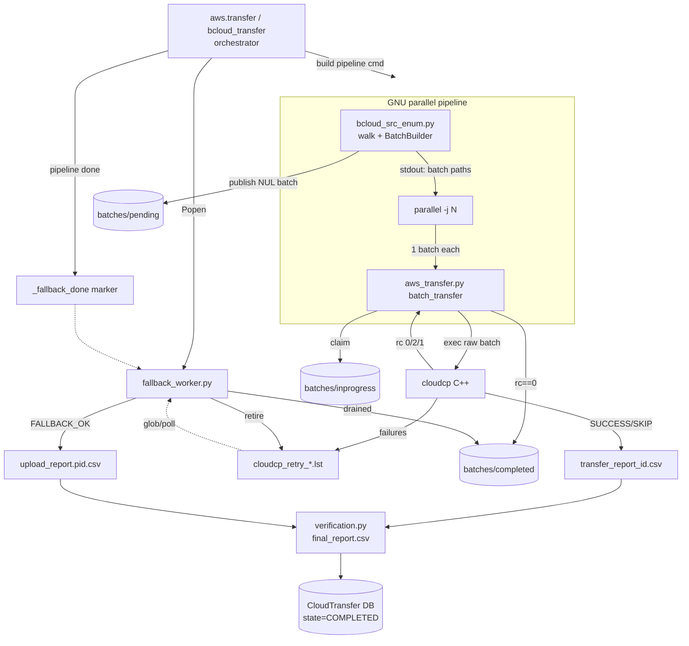
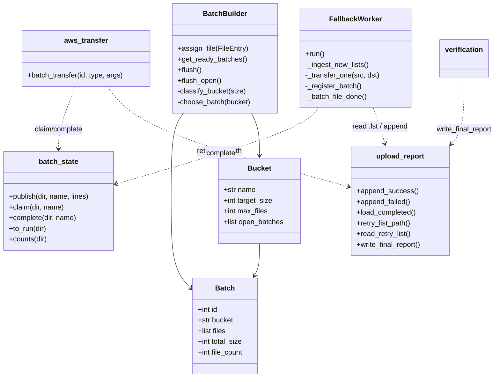
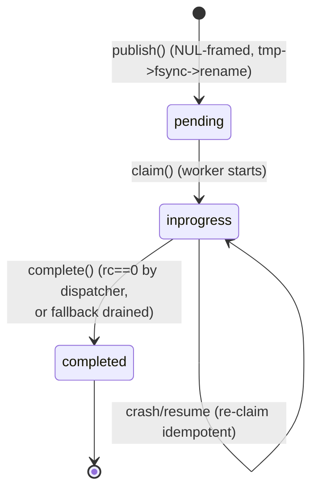
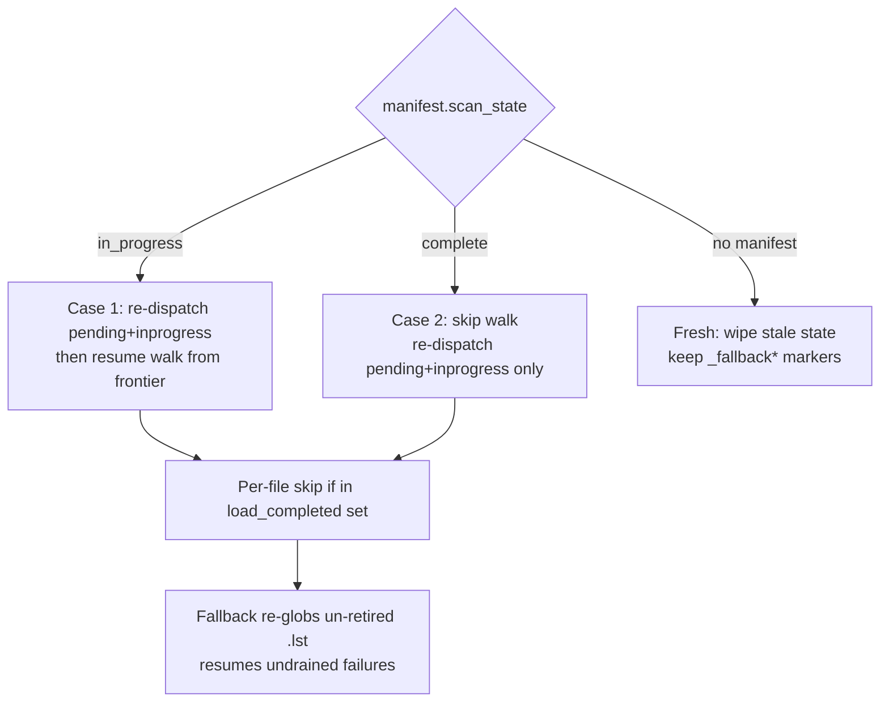

# Cloud Upload Pipeline — Implementation Document

**Status:** Implemented (pending review). Nothing committed.
**Scope:** The complete upload path from directory enumeration → batch building → transfer
scheduling → cloudcp upload → boto3 fallback → batch completion → transfer completion/verification,
including the messages/protocols, inputs, outputs, and exceptions between every module.

**Related docs:**
- `docs/config_reference.md` — every config key + on-disk layout.
- `docs/batch_builder_design.md` — batch-sizing algorithm, tiers, throttles (DT2 / low-bandwidth).
- `docs/bcloud_redesign_proposal.md` — design rationale and challenge list.
- `docs/pipelined_transfer_design.md` — streaming/backpressure model.
- `cloudcp/docs/cloudcp_io_redesign.md` — the cloudcp C++ side contract.

---

## 1. Overview

A transfer takes a source tree (or S3 bucket, for download) and moves it to/from S3. The pipeline:

1. **Enumerate** the source resumably (`bcloud_src_enum.py`), grouping files into **batches**
   (`BatchBuilder.py`) written to a **batch-state directory** (`batch_state.py`).
2. **Schedule** each batch to a **cloudcp** worker via GNU `parallel`, one Python dispatcher
   (`aws_transfer.py`) per batch.
3. **Upload** the whole batch with cloudcp (C++), which verifies each object (HeadObject) and writes
   its own report + per-batch retry list.
4. **Fallback** (`fallback_worker.py`) retries cloudcp's failures via boto3 (ARN/assumed-role aware).
5. **Complete** each batch (`pending → inprogress → completed`) — owned by the dispatcher on full
   success, or by the fallback after it drains the batch's failures.
6. **Finish** the transfer: `cloud_transfer.transfer` reconciles state and runs
   `verification.py`, which emits the merged `final_report.csv`.

**Central design decision:** cloudcp consumes the **raw NUL-framed batch file directly** and writes
its **own outputs**; Python does **no pre/post-processing** of batch text. Failed-upload handoff and
batch completion are **socket-free and file-driven** — cloudcp's durable per-batch `.lst` is the
queue; the fallback globs, drains, and owns completion.

### 1.1 End-to-end flow



### 1.2 Component / class view



---

## 2. Stage 1 — Orchestration (`aws.py :: transfer` / cloud entrypoint)

| Aspect | Detail |
|--------|--------|
| **Inputs** | `src`, `dst`, `transfer_id`; config `bcloud` (JSON). Key config: `AWS_PARALLEL`, `AWS_THREAD` (parallel workers), `TM_THREAD_POOL_SIZE`, `AWS_CMD` (cloudcp bin), `AWS_CP_FALLBACK`, `BATCH_FILE_DIR`, `LOCAL_AWS` (endpoint). |
| **Outputs** | Spawned fallback subprocess; the assembled shell pipeline; `_fallback_done` marker; return `(state, msg)`. |
| **Responsibilities** | (1) validate src/dst + bucket reachability; (2) ensure `transfer_<id>/` exists; (3) launch fallback worker; (4) build the `bcloud_src_enum | parallel aws_transfer` command; (5) run it via `cloud_transfer.transfer` (blocking); (6) write `_fallback_done`; (7) wait for the fallback to finish draining before returning. |

**Validation exceptions (early return `"FAILED", <msg>`):**
- upload: dst bucket not found; source not readable.
- download: src bucket not found; dst not writable.

**Fallback launch protocol (socket-free):**
```
/opt/bryck/.venv/bryck/bin/python3 <dir>/fallback_worker.py \
    <transfer_id> <upload|download> --transfer-dir <BATCH_FILE_DIR>/transfer_<id> --pool-size <N>
```
- A stale `_fallback_done` marker is removed first.
- After `Popen`, a 0.5s liveness check: if the worker already exited, fallback is disabled for the
  run (logged) and the pipeline proceeds without it.

**Pipeline command (upload example):**
```
bcloud_src_enum.py -i <id> "<src>" | parallel -j <N> '
    aws_transfer.py "<id>" \"<batch>\" \"<dst>\" \"<src>\" --expected-size ... <endpoint>'
```
`parallel` feeds each batch-file path (one stdout line from the enumerator) as `{}` to a fresh
`aws_transfer.py` process.

**Completion handshake:** after the pipeline returns, the orchestrator writes `_fallback_done` and
calls `fallback_proc.wait()` — so verification never starts before the fallback has drained all
`.lst` files. On timeout/exception the worker is killed.

---

## 3. Stage 2 — Batch building (`BatchBuilder.py`)

Groups a stream of `FileEntry(size, path)` into batches sized for cloudcp throughput. Full algorithm
and throttles: `docs/batch_builder_design.md`.

| Aspect | Detail |
|--------|--------|
| **Inputs** | `FileEntry` stream from the enumerator; `config` (flat keys or nested `BATCH.<TIER>.*`); `start_seq` (batch-id seed on resume). |
| **Outputs** | Ready `Batch` objects via `get_ready_batches()` (a generator draining an internal deque). |
| **Exceptions** | `classify_bucket` raises `ValueError` if no tier matches (should never happen — `large` is `inf`). |

**Size tiers & defaults** (per bucket: `max_files`, `target_size_mb`, `open_batches`):

| Tier | Size range | max_files | target MB | open_batches |
|------|-----------|-----------|-----------|--------------|
| zero | `< 1 B` | 2000 | 0 | 4 |
| tiny | `< 1 MB` | 511 | 256 | 8 |
| small | `< 64 MB` | 317 | 2048 | 8 |
| medium | `< 1 GB` | 50 | 10240 | 8 |
| large | `≥ 1 GB` | 5 | 51200 | 8 |

**Algorithm:**
1. `assign_file` → `classify_bucket(size)` picks a tier.
2. `choose_batch` round-robins across that tier's `open_batches` (keeps N batches filling
   concurrently → downstream parallelism).
3. If adding the file would exceed the tier's `target_size` **or** `max_files`, the current batch is
   sealed (appended to `ready_batches`) and replaced with a fresh batch (new id).
4. `flush()` seals all non-empty open batches (terminal, end of scan). `flush_open()` seals + replaces
   them (mid-scan checkpoint — a published batch must never be mutated later).

**Config resolution priority:** flat key (e.g. `TINYFILE_BATCH_SIZE`) > nested `BATCH.TINY.BATCH_SIZE`
> default. `start_seq` (from manifest `seq_high_water`) guarantees batch ids never collide across
resume (challenge #15).

---

## 4. Stage 3 — Enumeration & scheduling (`bcloud_src_enum.py`)

Resumable BFS walk that feeds BatchBuilder and publishes batches, printing each published batch path
to **stdout** for GNU parallel.

| Aspect | Detail |
|--------|--------|
| **Inputs (CLI)** | `-i/--transfer-id`, positional `source`, optional `--output-dir`, `--batch-size`, `--num-batches`. |
| **Inputs (config)** | `BATCH_FILE_DIR`, `AWS_THREAD`, `MIN_FREE_PCT`, `CHECKPOINT_EVERY_FILES`, batch tier keys, `LOCAL_AWS`. |
| **Outputs (stdout)** | Absolute batch-file paths (one per line) → GNU parallel. In single-file mode (`batch_size==1`), individual file paths. |
| **Outputs (disk)** | `manifest.json`; `scan.discovered`/`scan.completed` NUL journals; batches under `batches/pending/`. |
| **Exit codes** | `0` success; `RC_NO_SPACE=2` (preflight/ENOSPC pause); `RC_STOPPED=130` (SIGINT/SIGTERM, resumable). |

**Walk & publish loop** (`enumerate_dir`): BFS via a deque of directories; per file it stats size,
accumulates `total_files/total_bytes`, **skips files already in the report**
(`already_transferred` → `upload_report.load_completed`), else `builder.assign_file`. Ready batches
are drained and `publish_batch`'d immediately (streaming — no full listing held in memory).

**Checkpointing:** every `CHECKPOINT_EVERY_FILES` files (default 100000) and on signal, it fsyncs the
frontier journals + manifest (`flush_open` seals in-flight batches). This bounds resume granularity.

**Free-space guards:** preflight refuses to start below `MIN_FREE_PCT`; a batch write hitting
`ENOSPC` removes the partial file and returns `RC_NO_SPACE` (challenges #17/#18).

**Resume preflight:** `upload_report.resume_precheck` — if the report dir isn't creatable/writable the
transfer refuses to start (can't resume what can't be recorded; challenge #1).

**Scheduling contract with GNU parallel:** enumeration and transfer run **concurrently** — the
enumerator streams batch paths as it discovers them; `parallel -j N` dispatches up to N cloudcp
workers. Backpressure is via the pipe (design in `pipelined_transfer_design.md`).

---

## 5. Stage 4 — Batch state machine (`batch_state.py`)

A batch file's **directory is its state**; every transition is an atomic `os.rename`.



| API | Input | Output | Notes |
|-----|-------|--------|-------|
| `publish(dir,name,lines,min_free_check)` | batch name + path iterable | writes `pending/<name>` | NUL-framed binary (`os.fsencode(p)+\0`); atomic. |
| `claim(dir,name)` | name | path or `None` | `None` if already `completed` (resume dedup); idempotent re-claim of `inprogress`; resolves lost races. |
| `complete(dir,name)` | name | — | atomic `inprogress→completed`; idempotent + cross-process safe. |
| `to_run(dir)` | — | `[(name,path)]` | `pending`+`inprogress` (for resume re-dispatch). |
| `counts(dir)` | — | `{pending,inprogress,completed}` | progress/telemetry. |
| `reset_inprogress_tmp(dir)` | — | — | clears stale `.tmp` from an interrupted publish. |

---

## 6. Stage 5 — Transfer dispatch (`aws_transfer.py :: batch_transfer`)

One process per batch (spawned by GNU parallel).

| Aspect | Detail |
|--------|--------|
| **Inputs** | `transfer_id`, `transfer_type`, `args=[batch_path, dst("s3://…"), base_src, (endpoint tokens…)]`. Config: `AWS_CMD`, `AWS_CP_FALLBACK`, `PERF_STATS`. |
| **Outputs** | batch-state transition; count-only live progress; PERF log line. |
| **Exceptions** | cloudcp non-zero rc handled by the exit-code rule; a fatal rc leaves the batch `inprogress` for resume (no raise). |

**Sequence:**
1. `batch_state.claim(dir, name)`; if `None` (already completed on a prior run) → return.
2. Parse `bucket, prefix = url_parse(dst)`; `fs_prefix = base_src`.
3. Build & run the cloudcp CLI:
```
<AWS_CMD> "<batch>" --bucket "<bucket>" --fs-prefix "<src_root>" --transfer-id <id> \
          [--prefix "<prefix>"] [<endpoint args>]
```
4. Apply the **exit-code rule** (§9.3) → complete or defer or leave-inprogress.
5. On `rc==0`, `_batch_record_count` (count `\0`; newline fallback) advances a **count-only**
   live-progress estimate (`update_state` + `update_transfer_progress`). Authoritative byte/skip/fail
   totals come from report reconciliation at finalize.

**Removed (dead after cutover):** `batch_preprocess/postprocess`, `parse_batch_output`,
`*_prechecks`, `upload_postcheck`, `_report_success/_failure`, `_parse_size_etag`,
`_completed_set/_cache`, `_get_fallback_socket_path`, unused `re`/`shutil`. **Kept:** `aws_cksum`,
`download_postcheck` (single-file download), `get_relativepath`, `fs_to_clean_key`,
`check_dst_parent`, single-file `upload()/download()`.

---

## 7. Stage 6 — cloudcp (external C++ contract)

Documented on the C++ side (`cloudcp_io_redesign.md`); the Python side only relies on this contract.

| Aspect | Detail |
|--------|--------|
| **Inputs** | raw NUL-framed batch file + CLI flags (§6.3). Forms keys as **raw bytes** (`fs_prefix` stripped, `prefix` joined) — no transcoding. |
| **Outputs** | `transfer_report_<id>.csv` (SUCCESS/SKIPPED rows); `cloudcp_failed.log` (human); `cloudcp_retry_<id>_<batch_stem>.lst` (NUL failures). All under `<LOGS_DIR>/cloud_transfer_<id>/`, written atomically. |
| **Exit codes** | `0` all ok; `2` partial (`.lst` written); `1` fatal (no `.lst`) **or** all-failed (`.lst` present). |
| **Verification** | HeadObject (existence + size) before recording SUCCESS (challenge #13). |

---

## 8. Stage 7 — Fallback worker (`fallback_worker.py`)

Socket-free boto3 drainer. A **separate client stack** from cloudcp's C++ SDK (the whole point:
insulate against C++ SDK edge cases).

| Aspect | Detail |
|--------|--------|
| **Launch** | `<id> <type> --transfer-dir <dir> --pool-size N`. |
| **Inputs** | globs `cloudcp_retry_<id>_*.lst`; config `FALLBACK` sub-object (`min/max_processes`, `threads_per_process`, `max_attempts`, `backoff_base_sec`, `backoff_max_sec`, `poll_interval_sec`). |
| **Outputs** | `FALLBACK_OK` rows → `upload_report.<pid>.csv`; terminal failures → `error.<pid>.log` + `failed_uploads.<pid>`; `batch_state.complete`; `.lst → .lst.done`; txhistory log. |
| **Exit** | when `_fallback_done` marker exists AND queue empty AND nothing in-flight AND a final ingest finds no new `.lst`. Returns count of terminal failures. |

**Key methods:**
- `_ingest_new_lists()` — glob pending `.lst`, dedup by path, `read_retry_list`, `_register_batch`
  (records outstanding count), enqueue `(src,dst,key)` per record. Empty `.lst` → complete batch +
  retire list directly.
- `run()` — load-scaled `ThreadPoolExecutor`: in-flight target tracks the live backlog between
  `min_concurrency` and `max_concurrency`; polls for new `.lst` every `poll_interval_sec`.
- `_transfer_one(src,dst)` — boto3 upload/download with **retry/backoff** (`max_attempts`,
  exponential), `clean_s3_key` (recovers botocore-encodable key from surrogateescape bytes),
  HeadObject size-match verify. Returns `(src,dst,rc,size,etag,err)`.
- `_register_batch` / `_batch_file_done` — per-batch completion accounting: decrement outstanding;
  at zero → `batch_state.complete` + rename `.lst→.lst.done`. Batch completion only fires **after**
  the result is durably recorded.

**Concurrency scaling:** `max_concurrency = max_processes × threads_per_process` (or `pool_size`);
`min_concurrency = min_processes × threads_per_process` (or a small floor). Drains only the failed
subset, so it never pins max concurrency under light load (challenge #4/#21).

---

## 9. Cross-module protocols & agreements

These invariants bind the modules; changing one requires updating every party.

### 9.1 Batch framing (producer `batch_state.publish` / `BatchBuilder`; consumer cloudcp)
Raw absolute-path bytes, each terminated by `\0`, written binary via `os.fsencode`. NUL is the only
byte illegal in a POSIX path → paths with newline/CR/TAB/trailing-space survive byte-for-byte
(challenges #9–#12). Atomic tmp→fsync→rename.

### 9.2 cloudcp CLI (producer `aws_transfer`; consumer cloudcp) — see §6.3.

### 9.3 Exit-code → action (consumer `aws_transfer`)
| rc | `.lst`? | fallback enabled? | Action |
|----|---------|-------------------|--------|
| 0 | no | – | **complete** inline |
| 2 | yes | yes | **defer** (leave inprogress) |
| 1 | yes | yes | **defer** |
| 2 / 1 | yes/no | no (or no `.lst`) | **complete** inline (failures terminal, cloudcp recorded them) |
| 1 | no | – | **leave inprogress** (fatal — resume re-dispatches; log error) |

Guard: defer only when `fallback_enabled AND lst_exists`, preventing infinite resume.

### 9.4 Retry list `.lst` (producer cloudcp; consumer fallback)
Path `<log_dir>/cloudcp_retry_<id>_<batch_stem>.lst`, fully derivable from id+stem (no announce
message needed). NUL records `local_path \0 s3path \0 size \0 last_error \0`. Retired to `.lst.done`
after drain.

### 9.5 Batch completion (redesign §11)
> **done = cloudcp ran AND the fallback drained that batch's failed-set.**
`rc==0` → dispatcher completes; `rc∈{2,1-with-.lst}` → fallback completes after drain.
`batch_state.complete` is idempotent + cross-process safe.

### 9.6 Report schema (producers cloudcp + fallback; consumers resume + final report)
Columns `local_path,s3path,size,etag,status,attempt,finished_at`. Terminal-success statuses:
`SUCCESS`, `FALLBACK_OK`, `SKIPPED`. cloudcp's CSV and each `upload_report.<pid>.csv` share the schema
and are merged as equal sources.

### 9.7 Orchestration handoff (producer `aws.py`; consumer fallback) — see §2.

### 9.8 DB / progress (producer all stages; consumer UI)
`bcloud_sql.update_transferred_bytes` / `update_transfer_progress` push live counts;
`cloud_transfer` writes `CloudTransfer.transferstate`, `copiedbytes`, `thread_id`.

---

## 10. Stage 8 — Transfer completion & verification (`cloud_transfer.py`, `verification.py`)

`cloud_transfer.transfer(cloud_type, cmd, id, src, dst)` wraps the whole pipeline exec:

| Step | Detail |
|------|--------|
| Start | records worker PID + `transferstate=IN_PROGRESS` in `CloudTransfer`. |
| Run | `run_cmd(pipeline)`; on non-zero rc or "cannot resume job" → `state=FAILED`. |
| Pause/cancel race | re-reads `transferstate`; if `PAUSED/CANCELLED/STOPPED` → skip verification, return that state. |
| Init check | if `cloud_transfer_txhistory_<id>.log` missing → `PAUSED` ("failed to initiate"). |
| Failure log | if `cloud_transfer_<id>.log` non-empty → `PAUSED` (some files may not have succeeded). |
| Verify | if not paused/cancelled → `verify_transfer(...)` → verification state/msg wins (unless already FAILED). |
| Return | `(state, msg)`. Any exception → `FAILED`. |

**`verification.py :: TransferVerification.verify`:**
- Checks pause/cancel before and after verifying (won't verify a paused transfer; a pause during
  verification bails out — no state clobber).
- Sets `VERIFYING` only if not already paused/cancelled (confirms the state change to close the race).
- Runs the verifier, then `_generate_final_report`:
  - `iter_report_rows` / `write_final_report` build `final_report.csv`
    (`AbsoluteFilePath,S3Path,FileSize,ETag`) **directly from the merged report** — no bucket LIST
    (challenge #8). JSON variant filters to terminal-success rows.
- Writes a human summary and sets terminal state (`COMPLETED`/`Incomplete`).

---

## 11. On-disk layout (per transfer)

```
<BATCH_FILE_DIR>/transfer_<id>/
├── manifest.json                              # scan_state, seq_high_water, totals
├── scan.discovered / scan.completed           # NUL frontier journals
├── _fallback_done                             # marker written by aws.py
└── batches/{pending,inprogress,completed}/batch_NNNNNN.txt   # NUL-framed

<LOGS_DIR>/cloud_transfer_<id>/
├── transfer_report_<id>.csv                   # cloudcp SUCCESS/SKIPPED
├── cloudcp_failed.log                         # cloudcp human log
├── cloudcp_retry_<id>_batch_NNNNNN.lst[.done] # per-batch retry queue
├── cloud_transfer_txhistory_<id>.log          # per-file history (proof of init)
├── cloud_transfer_<id>.log                    # failure log (non-empty ⇒ PAUSED)
├── final_report.csv                           # merged at finalize
└── report/
    ├── upload_report.<pid>.csv                # FALLBACK_OK (+ legacy SUCCESS)
    ├── error.<pid>.log
    └── failed_uploads.<pid>                    # NUL terminal failures
```

---

## 12. Resume model



- **Case 1 (enumeration interrupted):** re-dispatch published batches (O(batches), no walk), resume
  the walk from `discovered − completed`; keep publishing new batches.
- **Case 2 (enumeration finished):** skip the walk entirely; re-dispatch only outstanding batches.
- **Crash-safety:** `.lst` files are durable → fallback re-globs on restart; batch-state transitions
  are atomic renames; `claim` dedups already-completed batches; partially-done batches only re-run
  their unfinished files (report skip + cloudcp SKIPPED).

---

## 13. Exception / error matrix

| Stage | Condition | Handling | Surfaced as |
|-------|-----------|----------|-------------|
| Orchestrator | bucket not found / no perms | early return | `FAILED, <msg>` |
| Orchestrator | fallback worker dies on start | disable fallback, proceed | log only |
| Enumerator | preflight below `MIN_FREE_PCT` | refuse start | exit `RC_NO_SPACE=2` |
| Enumerator | `ENOSPC` during batch write | remove partial, pause | exit `RC_NO_SPACE=2` |
| Enumerator | report dir not writable | refuse start | exit `RC_NO_SPACE` |
| Enumerator | SIGINT/SIGTERM | checkpoint + stop | exit `RC_STOPPED=130` (resumable) |
| Enumerator | unreadable dir/entry | log, mark dir completed, continue | log only |
| Dispatcher | cloudcp rc==2 / 1-with-`.lst` | defer to fallback | batch stays `inprogress` |
| Dispatcher | cloudcp rc==1 fatal (no `.lst`) | leave `inprogress` | log error; resume re-runs |
| Fallback | per-file transient error | retry w/ backoff up to `max_attempts` | eventual `FALLBACK_OK` or terminal |
| Fallback | terminal failure | `error.log` + `failed_uploads` | report failure section |
| Fallback | size mismatch after upload | treated as failure | terminal |
| cloud_transfer | pipeline non-zero / "cannot resume" | `state=FAILED` | `(FAILED, err)` |
| cloud_transfer | txhistory log missing | `PAUSED` | init failure |
| cloud_transfer | failure log non-empty | `PAUSED` | partial-success warning |
| cloud_transfer | paused/cancelled mid-run | skip verification | return that state |
| Verification | exception | logged, non-fatal | keeps prior state |

---

## 14. Implemented vs. future work

### 14.1 Implemented
- Resumable streaming enumeration + BatchBuilder tiers/throttles feeding NUL-framed batches.
- Atomic batch state machine (`pending/inprogress/completed`) with idempotent claim/complete.
- cloudcp-v2 CLI dispatch + exit-code→state rule; **all** batch pre/post-processing removed.
- Socket-free, file-driven fallback: glob-drain, per-batch completion, `.lst→.lst.done`, dynamic
  pool, retry/backoff, HeadObject verify, boto3 (ARN/assumed-role aware).
- `upload_report` merge of cloudcp CSV + shards → resume-skip set + `final_report.csv`.
- Orchestration migrated to `--transfer-dir` + `_fallback_done` marker (socket fully removed).
- Verification/final report from merged report (no bucket LIST); pause/cancel race handling.
- Two-case resume (enumeration-interrupted / enumeration-finished) + crash-safe `.lst` re-glob.
- Docs updated (`config_reference.md`); 19-check stub test suite passing.

### 14.2 Slated for next improvements
- **Authoritative live progress:** current `rc==0` progress is count-only; byte/skip totals reconcile
  at finalize. Add a cloudcp progress channel or tail the report for live bytes.
- **Long-lived §2 orchestrator (open):** decide GNU-parallel vs. the redesign's long-lived per-batch
  orchestrator (current assumption: per-batch completion in the existing parallel model).
- **Fallback observability:** structured metrics (backlog, in-flight, retries, terminal failures) +
  heartbeat.
- **Retention policy** for `.lst.done` and report shards after a verified transfer.
- **Real-cloudcp integration test** exercising rc 0/2/1 and actual `.lst` emission (current tests stub
  at the Python boundary).
- **Lock cloudcp flag names** against the shipped binary once released.

---

## 15. Testing

Stub harness (no psycopg2/AWS) registers stub parent packages + leaf modules
(`libutils`, `bcloud_sql`, `aws`, `config`, `filelock`) and loads the real modules by file.
Coverage (19 checks, all passing):
- **A** — `read_retry_list`/`iter_pending_retry_lists` round-trip with newline/TAB/trailing-space paths.
- **B** — final-report merge includes cloudcp CSV (`SUCCESS`/`SKIPPED`) + fallback shard (`FALLBACK_OK`);
  header row not counted.
- **C** — `batch_transfer` exit-code branches: `0`→completed, `2`+`.lst`→inprogress, `2` no-`.lst`
  →completed, `1` fatal→inprogress.
- **D** — fallback drain: ingest `.lst` → drain → batch `completed` + `.lst→.lst.done`.

Validation: `python3 -m py_compile` across all modules (clean) + the stub harness.
